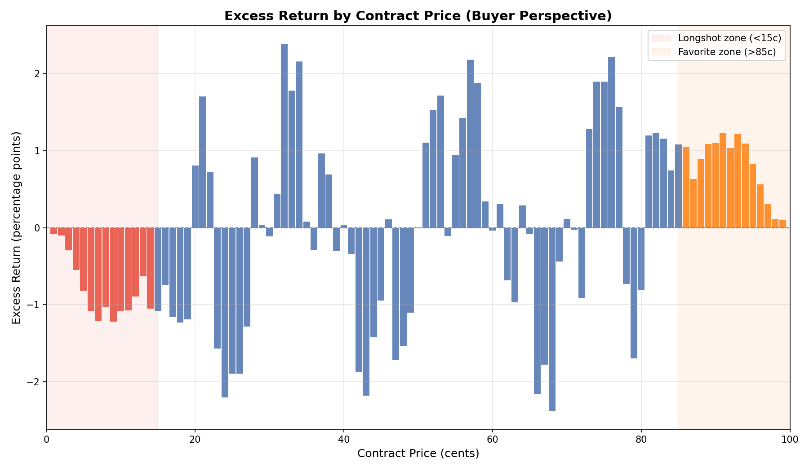
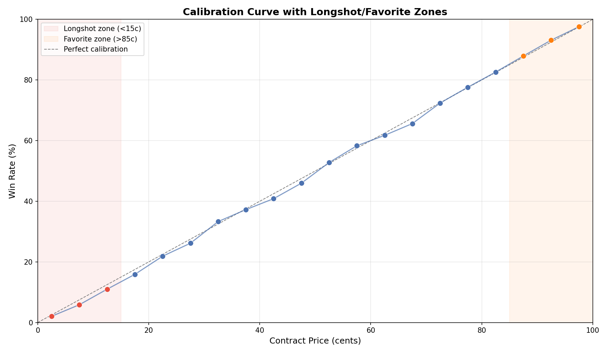
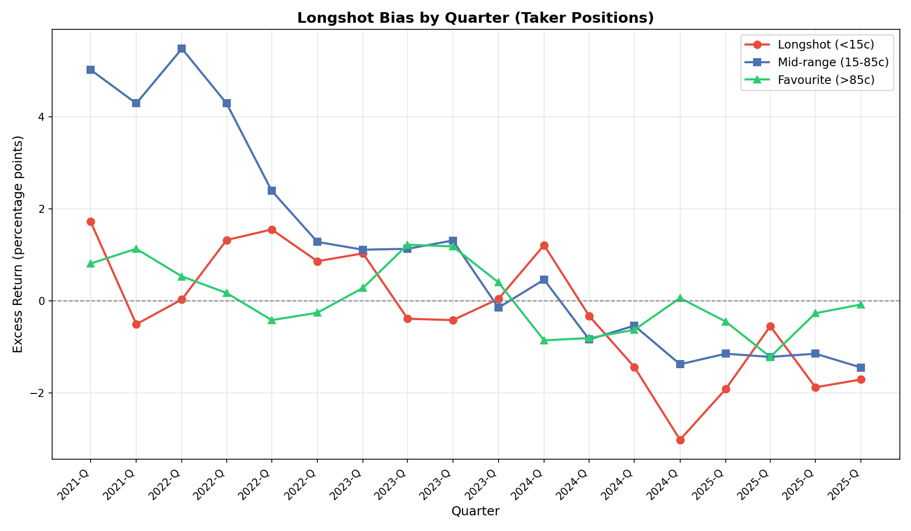

# §1.1: Longshot Bias

## Summary

Kalshi still shows a clear longshot/favorite asymmetry, but the magnitude is larger under contract weighting than in the earlier trade-weighted draft.

- Longshot buyers (<15c) earn **-1.19 pp contract-weighted** excess return (vs **-0.74 pp trade-weighted**).
- The mirror favorite zone (>85c) earns **+1.20 pp contract-weighted** (vs +0.75 pp trade-weighted).
- A fade-longshot strategy (sell YES / buy NO when YES <15c) earns **+1.19 cents per contract** at **95.20%** win rate on **6.17B contracts**.

## Methodology

- Universe: finalized Kalshi yes/no markets.
- Construction: each trade contributes taker and maker position-sides.
- Primary metric: **contract-weighted** excess return (`win_rate - price`), where 1 pp equals 1 cent per contract.
- Reporting also includes trade-weighted values for comparability with prior drafts.
- Calibration figure buckets are used for visualization only; expected probability is computed from exact prices.

## Core Results

| Zone | Trades | Contracts | Avg Price (c, contract-wtd) | Win Rate (%, contract-wtd) | Excess Return (pp, contract-wtd) | Excess Return (pp, trade-wtd) |
|---|---:|---:|---:|---:|---:|---:|
| Longshot (1-14c) | 19,014,550 | 6,174,473,687 | 5.99 | 4.80 | -1.19 | -0.74 |
| Favorite (86-99c) | 19,049,216 | 6,223,338,891 | 94.04 | 95.24 | +1.20 | +0.75 |

### Bucketed Calibration (Tail Buckets)

| Bucket | Avg Price (c) | Win Rate (%) | Excess Return (pp) | Trades | Contracts |
|---|---:|---:|---:|---:|---:|
| 0-5c | 2.15 | 1.54 | -0.60 | 6,643,756 | 2,778,949,440 |
| 5-10c | 6.87 | 5.20 | -1.67 | 6,447,186 | 1,875,950,728 |
| 10-15c | 11.93 | 10.26 | -1.67 | 5,923,608 | 1,519,573,519 |
| 85-90c | 87.02 | 88.58 | +1.57 | 5,864,687 | 1,477,386,089 |
| 90-95c | 92.09 | 93.82 | +1.73 | 6,341,324 | 1,788,284,866 |
| 95-100c | 97.48 | 98.23 | +0.75 | 8,078,847 | 3,252,303,809 |

## Strategy Implication

- **Fade longshots:** +1.19 c/contract gross edge, average opposing price 94.01c, win rate 95.20%.
- Approximate gross ROC per contract is **1.27%** (`1.19 / 94.01`) before fees/slippage.
- **Do not fade favorites** under this signal alone (mirror strategy is -1.20 c/contract).

## Figures

- 
- 
- 

## Limitations

- Gross of fees, spread crossing, and inventory financing.
- Temporal chart remains a separate (trade-weighted) decomposition.
- Results are aggregate; edge can vary by category and regime.
