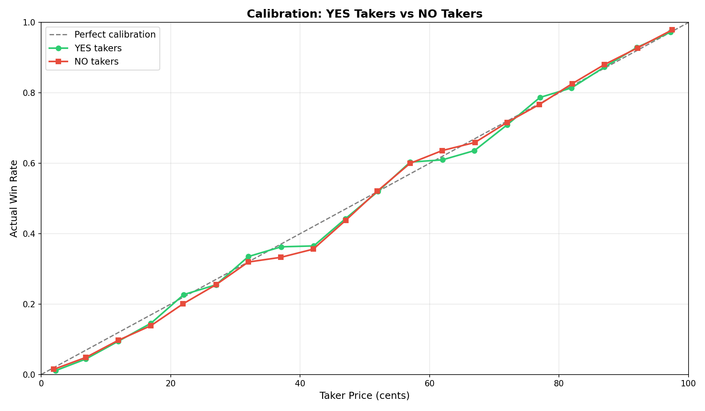
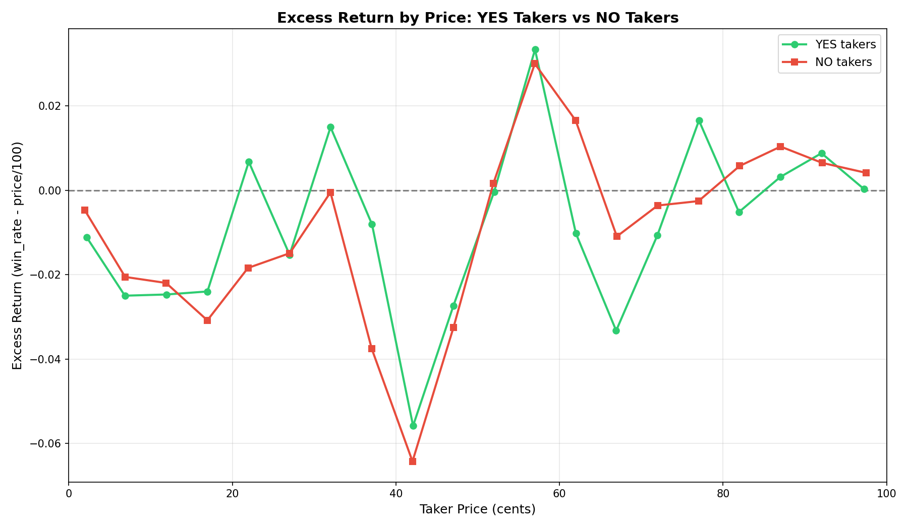

# §1.2: Favourite-Longshot Asymmetry

## Summary

Using exact-price, contract-weighted excess returns:

- YES takers: **-0.9293 pp**
- NO takers: **-0.6078 pp**
- YES-NO gap: **-0.3215 pp** (YES worse)

The asymmetry remains directionally present, but it is materially smaller than the old trade-weighted midpoint-based estimate.

## Methodology

- Universe: finalized Kalshi yes/no markets.
- Side construction:
  - YES takers priced at `yes_price`, win if result is yes.
  - NO takers priced at `no_price`, win if result is no.
- Excess return is computed from exact price points, then aggregated with **contract weighting**.
- 5-cent buckets are used only for visualization.

## Overall Metrics

| Side | Trades | Contracts | Weighted Avg Excess Return (pp) | MAE (pp) |
|---|---:|---:|---:|---:|
| YES takers | 46,755,669 | 11,885,081,735 | -0.9293 | 2.1951 |
| NO takers | 20,968,702 | 5,295,854,594 | -0.6078 | 1.6660 |

Asymmetry summary:

- Overall: **-0.3215 pp**
- Low price (1-20c): **-0.4170 pp**
- Mid price (21-79c): **+0.2426 pp**
- High price (80-99c): **-0.4220 pp**

## Price-Range Table

| Price Range | YES Excess (pp) | NO Excess (pp) | Asymmetry (pp) | YES Trades | NO Trades |
|---|---:|---:|---:|---:|---:|
| 1-10 | -1.75 | -1.00 | -0.75 | 5,485,648 | 2,239,555 |
| 11-20 | -2.24 | -2.70 | +0.46 | 4,915,662 | 1,378,857 |
| 21-30 | -0.36 | -1.21 | +0.85 | 5,179,933 | 1,414,514 |
| 31-40 | +0.08 | -2.73 | +2.81 | 5,599,783 | 1,622,124 |
| 41-50 | -4.04 | -4.18 | +0.14 | 5,916,765 | 1,931,784 |
| 51-60 | +1.85 | +1.74 | +0.11 | 5,717,695 | 2,130,095 |
| 61-70 | -2.20 | +0.35 | -2.55 | 4,765,803 | 2,032,629 |
| 71-80 | -0.18 | -0.32 | +0.14 | 3,680,127 | 2,182,401 |
| 81-90 | +0.61 | +0.86 | -0.25 | 2,974,699 | 2,493,219 |
| 91-99 | +0.34 | +0.46 | -0.12 | 2,519,554 | 3,543,524 |

## Interpretation

- YES still underperforms NO in aggregate, but the penalty is modest at ~0.32 pp.
- The strongest negative YES-vs-NO asymmetry appears in **61-70c**.
- Several higher-price ranges are positive for both sides under contract weighting.

## Figures

- 
- 

## Limitations

- Gross of fees and spread costs.
- Side-level aggregates can mask category/time interactions.
