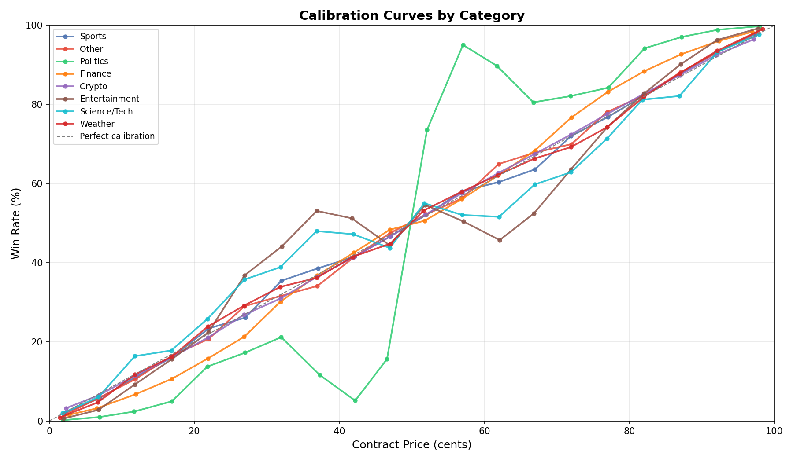
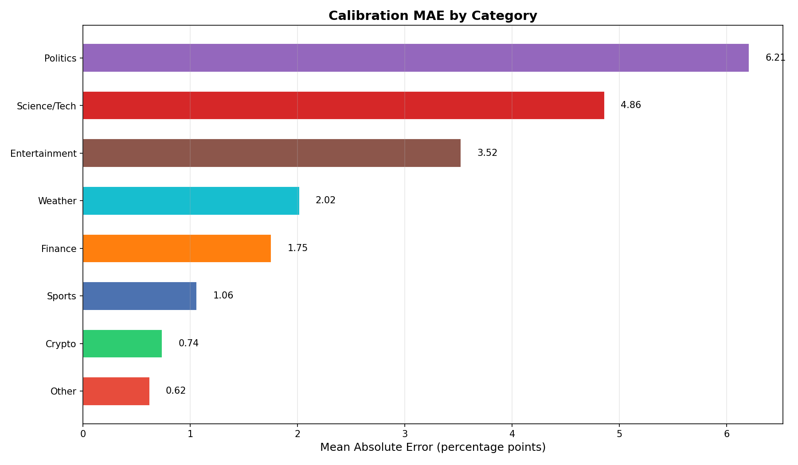
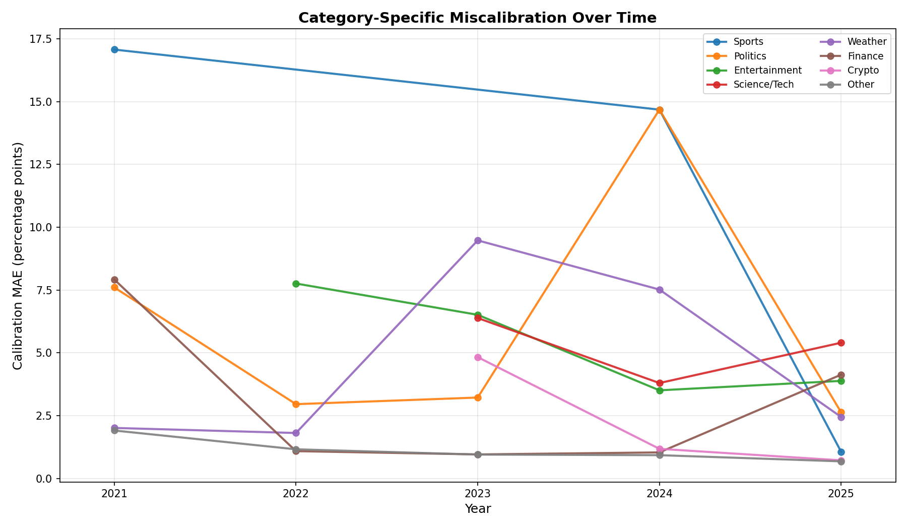

# §1.3: Category-Specific Miscalibration

## Summary

Kalshi markets exhibit substantially different calibration quality across category groups. Politics is the most miscalibrated category with a weighted MAE of 6.21 percentage points, followed by Science/Tech (4.86 pp) and Entertainment (3.52 pp). High-volume categories like Sports (1.06 pp), Crypto (0.74 pp), and the catch-all Other bucket (0.62 pp) are much better calibrated, suggesting that liquidity and price discovery are strongly correlated with calibration accuracy.

## Methodology

- **Data source:** All finalized Kalshi markets with a `yes`/`no` result, joined with their trade history.
- **Position construction:** Each trade generates two positions -- one for the taker side at the taker's price, and one for the counterparty (maker side) at the complementary price. This ensures symmetric treatment of both sides of every trade.
- **Category extraction:** The leading alphanumeric prefix of each market's `event_ticker` is extracted via regex and then mapped to one of 8 high-level groups: Sports, Politics, Crypto, Finance, Weather, Entertainment, Science/Tech, and Other.
- **Calibration computation:** Prices are bucketed into 5-cent-wide bins (midpoints at 2.5, 7.5, ..., 97.5). Only buckets with at least 100 observations are retained. Win rate is computed per bucket per group.
- **MAE metric:** Mean Absolute Error is computed as the trade-weighted average of |win_rate - bucket_midpoint| across all valid buckets for each group.
- **Sample:** 3,517 distinct raw event-ticker prefixes mapped into 8 groups, covering ~135.5 million total position-sides across all categories.

## Results

### Calibration Curves by Category

The chart overlays calibration curves for all 8 category groups against the perfect-calibration diagonal. Several patterns are immediately visible:

- **Sports, Crypto, and Other** track the diagonal closely across the full price range, showing tight calibration from low to high prices.
- **Politics** shows the largest deviations, with systematic overpricing of favorites (high-price contracts win less often than their price implies) and underpricing of longshots (low-price contracts win more often than expected). This classic favorite-longshot bias is strongest in political markets.
- **Science/Tech** and **Entertainment** show similar but less extreme deviations, with noticeable kinks in the mid-range (30-70 cent) buckets.
- **Weather** shows modest miscalibration, primarily in the 60-80 cent range where win rates fall below the diagonal.
- The mid-range price buckets (roughly 25-40 and 60-75 cents) exhibit the largest cross-category dispersion, consistent with the finding that these "uncertain" price ranges are hardest for markets to calibrate.

### Mean Absolute Error by Category

| Category      | MAE (pp) | Total Trades    |
|---------------|----------|-----------------|
| Politics      | 6.21     | 6,881,609       |
| Science/Tech  | 4.86     | 292,292         |
| Entertainment | 3.52     | 618,440         |
| Weather       | 2.02     | 348,074         |
| Finance       | 1.75     | 8,421,934       |
| Sports        | 1.06     | 71,054,938      |
| Crypto        | 0.74     | 13,407,950      |
| Other         | 0.62     | 34,460,534      |

The overall trade-weighted MAE across all groups is **1.24 pp**, but this masks a 10x range from Other (0.62 pp) to Politics (6.21 pp). The three worst-calibrated categories -- Politics, Science/Tech, and Entertainment -- share a common trait: outcomes are harder to model with quantitative approaches and tend to attract more sentiment-driven trading.

The worst miscalibration by price range occurs in the 30-35 cent bucket (4.40 pp average error) and the 65-70 cent bucket (4.38 pp average error), which are roughly symmetric around 50 cents and correspond to the zone of maximum uncertainty.

## Key Findings

- **Politics is the most exploitable category**, with 6.21 pp MAE -- more than 3x the market-wide weighted average. Political markets show a pronounced favorite-longshot bias, making them ripe for contrarian strategies that fade extreme prices.
- **Liquidity correlates strongly with calibration quality.** The four best-calibrated groups (Sports, Crypto, Other, Finance) account for 94% of all trades and have MAEs below 2 pp. The four worst-calibrated groups collectively represent only 6% of trades.
- **Mid-range prices (25-40 and 60-75 cents) are the weakest calibrated** across all categories. This is where implied probabilities diverge most from realized outcomes, suggesting that edge is concentrated in "toss-up" and "likely-but-not-certain" price ranges rather than at the extremes.

## Strategy Implication

A category-aware calibration overlay can improve any base trading strategy:

1. **Tilt toward low-liquidity, high-MAE categories.** Politics, Science/Tech, and Entertainment offer the widest spreads between implied and realized probabilities. A strategy that focuses on these categories can capture 3-6 pp of calibration edge before transaction costs.
2. **Target mid-range prices (25-75 cents).** Within any category, the greatest miscalibration lives in the "uncertain" price zone, not at the tails. Strategies should preferentially seek positions priced in this range.
3. **Use category-specific calibration adjustments.** Rather than applying a single recalibration curve market-wide, apply per-category adjustments. A 50-cent contract in a political market should be treated differently from a 50-cent contract in a sports market.
4. **Size inversely to liquidity with caution.** While less-liquid categories offer more edge, they also impose higher execution costs and slippage. Position sizing should balance calibration edge against realistic fill assumptions.

## Temporal Analysis

### Category Calibration Over Time

The temporal decomposition reveals that category-level miscalibration is highly non-stationary, with most categories improving over time but notable exceptions during event-driven disruptions.

### Yearly MAE by Category (pp)

| Category      | 2021   | 2022   | 2023   | 2024    | 2025   | Trend      |
|---------------|--------|--------|--------|---------|--------|------------|
| Sports        | 17.08* | --     | --     | 14.68*  | 1.06   | Improved   |
| Politics      | 7.61*  | 2.96   | 3.22   | **14.68** | 2.63 | Improved (with 2024 spike) |
| Entertainment | --     | 7.76*  | 6.52*  | 3.51    | 3.88   | Improved   |
| Science/Tech  | --     | --     | 6.39*  | 3.80    | 5.40   | Mixed      |
| Weather       | 2.01   | 1.81   | 9.48*  | 7.52    | 2.45   | Worsened   |
| Finance       | 7.92*  | 1.09   | 0.96   | 1.04    | 4.13   | Mixed      |
| Crypto        | --     | --     | 4.83*  | 1.18    | 0.72   | Improved   |
| Other         | 1.91   | 1.16   | 0.95   | 0.93    | 0.68   | Improved   |

\* Low trade count (<50K); estimate is noisy. Bold = worst single-year reading for that category.

### Key Temporal Patterns

**Politics shows a dramatic 2024 election spike.** Political market MAE surged from 3.22 pp in 2023 to **14.68 pp in 2024** -- a 4.6x increase and the worst single category-year reading in the dataset (on 2.3M trades, so not a small-sample artifact). This confirms that the calibration drift observed in §1.4 was heavily concentrated in political markets. By 2025, Politics had recovered to 2.63 pp -- its best reading ever -- suggesting the post-election recalibration overshoot may have actually *improved* the category.

**Crypto underwent a remarkable calibration improvement.** From 4.83 pp in 2023 (on only 884 trades) to 0.72 pp in 2025 (on 11.8M trades) -- a 6.7x improvement coinciding with a 13,000x volume increase. This is the clearest example of the liquidity-calibration relationship: as Crypto markets attracted more sophisticated participants, pricing efficiency improved dramatically.

**Finance shows a concerning 2025 deterioration.** After achieving excellent calibration in 2022-2023 (~1.0 pp), Finance MAE jumped to 4.13 pp in 2025. This may reflect the introduction of new, harder-to-price financial products or structural changes in the Finance category composition.

**Weather is the only category with a net worsening trend** (2.01 pp in 2021 to 2.45 pp in 2025), with a particularly bad 2023 (9.48 pp, though on only 8K trades). Weather markets appear resistant to the general calibration improvement trend seen across the platform.

**The "Other" catch-all consistently improved**, from 1.91 pp to 0.68 pp, and is now the best-calibrated category -- consistent with its high volume (28M trades in 2025) driving efficient pricing.

### Stationarity Assessment

The aggregate finding that Politics is the most miscalibrated category (6.21 pp) masks significant temporal variation: in 2025 alone, Politics (2.63 pp) is actually better calibrated than Science/Tech (5.40 pp), Finance (4.13 pp), and Entertainment (3.88 pp). The aggregate is dominated by the extreme 2024 spike. **Any strategy targeting category-specific miscalibration should use rolling estimates rather than static aggregates**, as the ranking of categories by calibration quality changes substantially year-to-year.

## Limitations

- The "Other" catch-all group is large (34M+ trades) and heterogeneous; it may contain sub-categories with significant miscalibration that is masked by aggregation.
- Category mapping relies on heuristic prefix matching of `event_ticker`. Some markets may be misclassified, though spot-checking suggests the mapping captures the dominant categories well.
- Calibration is measured in aggregate across all time periods. Category-specific miscalibration may be non-stationary -- e.g., political markets may become better calibrated as elections approach.
- MAE is computed on 5-cent buckets with a minimum of 100 observations. Low-volume categories (Science/Tech, Weather) have fewer valid buckets, making their MAE estimates noisier.
- Transaction costs, spread, and slippage are not modeled. A 6 pp calibration edge in Politics does not guarantee 6 pp of net profit.
