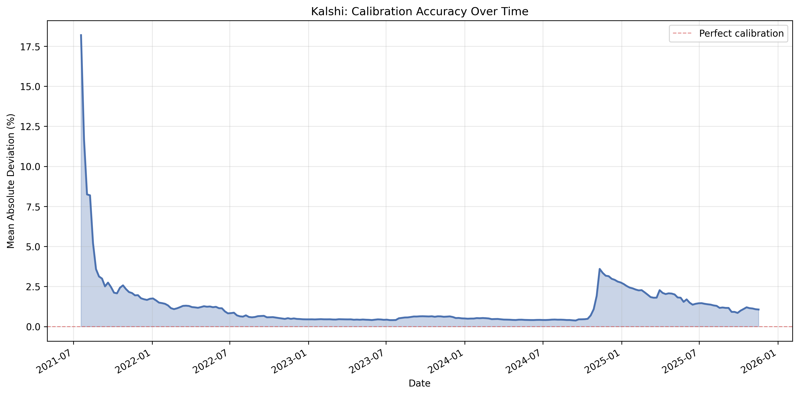

# §1.4: Calibration Drift

## Summary
Kalshi's calibration has followed a dramatic arc: from severely miscalibrated at launch (MAD ~18%) it rapidly improved to a stable plateau around 0.4% by late 2022 through mid-2024, then suffered a sharp disruption in late 2024 (peaking at 3.6% MAD in November 2024) before gradually recovering. As of the most recent data (November 2025), MAD sits at approximately 1.06% -- better than the post-shock peak but still roughly 2.5x the pre-shock equilibrium, suggesting the market has not yet fully re-calibrated.

## Methodology
This analysis uses the existing `kalshi_calibration_deviation_over_time` module which:
- Joins all trades with resolved market outcomes
- Constructs both taker and maker positions from each trade
- Groups by week and computes cumulative calibration deviation
- For each weekly endpoint, calculates mean absolute deviation of win rate from price across all price points

## Results

### Calibration Accuracy Over Time

The chart reveals three distinct regimes:

**Phase 1 -- Rapid Convergence (Jul 2021 - Jun 2022):** MAD plummets from 18.2% to roughly 1.0% in the first year. This is the classic pattern of a nascent market finding its footing as liquidity providers enter and price discovery improves. The steepest decline occurs in the first two months (18.2% to 3.0%).

**Phase 2 -- Stable Equilibrium (Jul 2022 - Sep 2024):** MAD fluctuates gently between 0.38% and 0.67%, with a brief bump in mid-2023 (Aug-Nov) where it rose from ~0.40% to ~0.64% before partially recovering. The low-water mark is reached in September 2024 at 0.38%. This is the most efficiently calibrated period in Kalshi's history.

**Phase 3 -- Election Shock and Recovery (Oct 2024 - Nov 2025):** Starting in October 2024, MAD spikes sharply from 0.48% to 3.60% by mid-November 2024 -- a nearly 10x increase in just five weeks. This almost certainly corresponds to the 2024 U.S. presidential election cycle, where high-profile political markets attracted speculative volume and possibly sentiment-driven mispricing. After the shock, MAD has been steadily declining: 3.60% (Nov 2024) to 2.27% (Mar 2025) to 1.06% (Nov 2025), though recovery has been slower than the initial convergence phase.

### Data Summary

| Milestone | Date | MAD (%) |
|-----------|------|---------|
| Launch (maximum) | Jul 2021 | 18.19 |
| First year settled | Jul 2022 | 0.70 |
| Pre-shock global minimum | Sep 15, 2024 | 0.38 |
| Election shock peak | Nov 10, 2024 | 3.60 |
| Post-shock (late Mar 2025) | Mar 30, 2025 | 2.27 |
| Most recent | Nov 16, 2025 | 1.06 |

**Overall trend direction:** Long-term improving, interrupted by a major regime-breaking event in late 2024.

**Secondary bump (mid-2023):** MAD rose from ~0.40% (Jul 2023) to ~0.64% (Sep-Oct 2023), possibly tied to increased activity around debt ceiling or other political markets, before drifting back down to ~0.50% by year-end 2023.

## Key Findings
- Kalshi calibration converged rapidly in its first year, dropping from 18% MAD to under 1% by mid-2022, consistent with a market maturing through increased participation and liquidity
- The market achieved its best calibration in mid-2024 (MAD ~0.38%), representing near-optimal pricing efficiency for a prediction market of this size
- The 2024 U.S. election triggered a massive calibration disruption, with MAD spiking nearly 10x in five weeks -- the largest deterioration since the platform's launch period
- Post-election recovery is underway but proceeding more slowly than the original convergence, with MAD still at ~1.06% a full year after the shock -- roughly 2.5x the pre-shock equilibrium
- A smaller calibration bump in mid-2023 (0.40% to 0.64%) suggests that political event cycles systematically degrade calibration, even outside presidential elections

## Strategy Implication
The data reveals that Kalshi's calibration is not monotonically improving -- it is punctuated by event-driven shocks that temporarily create large mispricings. This has direct strategic implications:

1. **During stable periods (MAD < 0.5%):** The market is well-calibrated and alpha opportunities are thin. Strategies should focus on spread capture and market-making rather than directional calibration bets.

2. **During political event cycles (MAD spikes):** Significant mispricing emerges, particularly around high-profile elections. Contrarian strategies that fade sentiment-driven extremes during these windows likely capture outsized returns. The 2024 election spike suggests that event-driven calibration bets could yield 2-4 percentage points of edge.

3. **During recovery phases (elevated but declining MAD):** The slow post-shock recovery (12+ months to halve MAD from 3.6% to ~1.1%) means that residual mispricings persist long after the catalyzing event. Patient strategies that exploit lingering miscalibration during these recovery windows may offer the best risk-adjusted opportunities.

4. **Forward-looking:** If the mid-2023 bump and the 2024 spike are both political-cycle artifacts, the next major calibration disruption may coincide with the 2026 midterm elections.

## Limitations
- Cumulative metric smooths over short-term fluctuations, potentially masking week-to-week volatility in calibration quality
- Early periods have less data, making MAD estimates noisier (the 18% initial reading reflects very few resolved contracts)
- Does not separate by category (see §1.3 for category-specific analysis) -- the election spike may be concentrated in political markets while other categories remained well-calibrated
- The analysis treats all price points equally; mispricings at extreme probabilities (near 0% or 100%) may have different economic significance than those near 50%
- Post-shock MAD decline could partly reflect cumulative averaging rather than genuine re-calibration, since the metric includes all historical data
