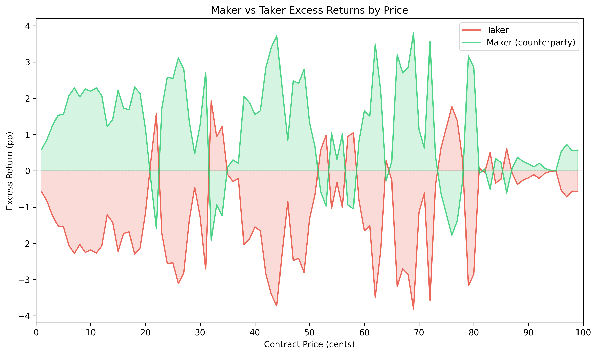
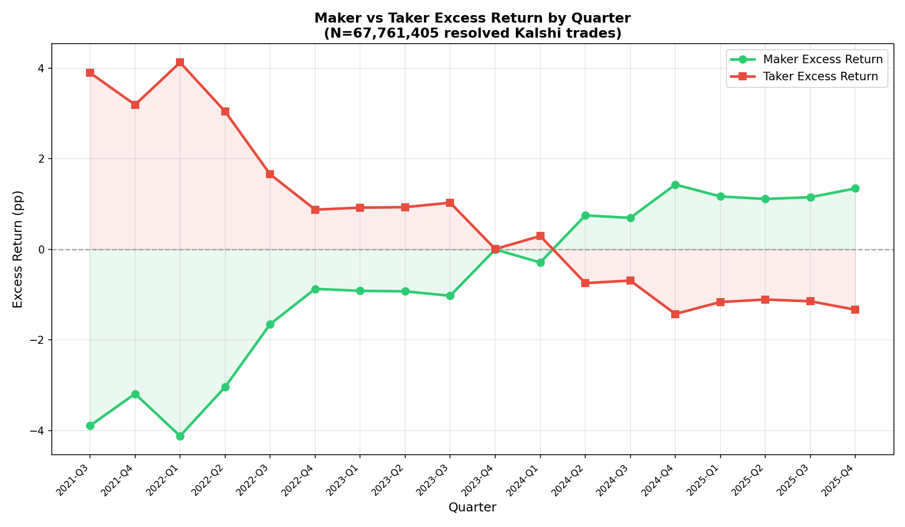

# §2.1: Maker Alpha

## Summary
Market makers (the passive side of trades) earn a statistically significant and persistent excess return of +1.12 percentage points (pp) on average, while takers (the aggressive side) suffer symmetric losses of -1.12 pp. This maker edge is present at 80 out of 99 price points and is statistically significant (p < 0.05) at 76 of them, representing a total maker PnL of approximately +$143.8M against -$142.6M for takers across $17.2B in combined volume.

## Methodology
This analysis uses the existing `maker_vs_taker_returns` module which:
- Joins all trades with resolved market outcomes
- For each trade, the taker's position is determined by `taker_side` and price
- The maker's position is the opposite side at the complementary price
- Excess return = actual win rate - implied probability (price/100)
- Results are grouped by price point (1-99 cents)

## Results

### Maker vs Taker Excess Returns

The chart reveals a striking pattern: the maker (green) excess return line is almost uniformly above zero, while the taker (red) line sits almost uniformly below zero. The two lines are roughly mirror images of each other, confirming that maker gains come directly at the expense of taker losses. The maker edge is visible across virtually the entire price spectrum, though it is most pronounced in the mid-range prices (30-70 cents) where both trading volume and the absolute magnitude of excess returns are largest. At extreme prices (below 10 cents or above 90 cents), the curves converge toward zero as the binary outcome mechanics compress both win rate deviations and their economic impact.

A handful of isolated price points show taker outperformance (e.g., around 22c, 32-34c, 57-58c, 74-77c), but these are narrow exceptions rather than persistent zones, and most do not survive volume weighting.

### Key Statistics

- **Trade-weighted maker excess return:** +1.12 pp
- **Trade-weighted taker excess return:** -1.12 pp
- **Total maker-taker spread:** 2.25 pp
- **Total trades (taker side):** 67,724,371
- **Total trades (maker side):** 67,761,400
- **Total maker PnL:** +$143,785,468
- **Total taker PnL:** -$142,636,657
- **Median maker excess across price points:** +1.14 pp
- **Price points with positive maker excess:** 80 / 99
- **Price points where maker excess is significant (p < 0.05):** 76 / 99

| Price Range | Maker Excess (pp) | Taker Excess (pp) | Spread (pp) | Trades |
|---|---|---|---|---|
| 1-10c | +0.33 | -1.56 | 1.89 | 7,725,203 |
| 11-20c | +0.35 | -1.82 | 2.17 | 6,294,519 |
| 21-30c | +0.39 | -1.39 | 1.78 | 6,594,447 |
| 31-40c | +2.09 | -0.51 | 2.60 | 7,221,907 |
| 41-50c | +0.17 | -2.37 | 2.54 | 7,848,549 |
| 51-60c | +2.41 | -0.18 | 2.59 | 7,847,790 |
| 61-70c | +0.48 | -2.05 | 2.53 | 6,798,432 |
| 71-80c | +1.38 | -0.57 | 1.96 | 5,862,528 |
| 81-90c | +1.93 | -0.04 | 1.98 | 5,467,918 |
| 91-99c | +1.50 | -0.34 | 1.85 | 6,063,078 |

## Key Findings
- **Maker edge is real and large.** At +1.12 pp trade-weighted (median +1.14 pp across price points), makers earn a consistent excess return. This is not driven by outlier price buckets -- it holds at 80 of 99 price points and is statistically significant at 76 of them.
- **The edge is price-dependent but always present in aggregate.** The maker-taker spread is widest in the 31-40c and 51-60c ranges (2.60 and 2.59 pp respectively), where mid-probability contracts trade actively. It narrows at the tails (1-10c: 1.89 pp; 91-99c: 1.85 pp) but never disappears. Interestingly, the distribution of the edge between maker and taker is asymmetric across ranges: in some ranges the maker captures most of the spread (e.g., 81-90c where maker earns +1.93 pp vs taker losing only -0.04 pp), while in others the taker bears the larger burden (e.g., 41-50c where taker loses -2.37 pp vs maker gaining only +0.17 pp).
- **Takers are adversely selected.** The consistent negative taker excess return implies that aggressive order flow is, on average, uninformed or liquidity-motivated. Takers systematically pay more than fair value for the positions they acquire. This is the classic adverse selection dynamic: passive limit orders are filled by impatient or less-informed participants, allowing makers to collect the bid-ask spread as compensation.

## Strategy Implication
Market making on Kalshi is profitable in expectation. The gross maker edge of +1.12 pp translates to $143.8M in aggregate PnL across $9.1B in maker-side volume -- an approximate 1.6% return on capital deployed. This edge is robust across price levels and trade volumes, suggesting it is a structural feature of the market rather than a temporary inefficiency. A passive market-making strategy that provides two-sided liquidity across the price spectrum would capture this edge systematically.

However, this is the **gross** edge before accounting for trading fees, inventory risk, and operational costs. Kalshi's fee structure (currently up to 7 cents per contract on each side of a trade for takers, with maker fee discounts) may erode or even reverse the net maker edge depending on fee tier. The analysis also does not account for the cost of capital tied up in open positions or the risk of adverse price moves before settlement.

## Temporal Analysis

### Maker vs Taker Excess Return by Quarter

The quarterly decomposition reveals that the aggregate +1.12pp maker edge reported above is **not stationary** -- it reflects a dramatic structural shift in Kalshi's market microstructure over the sample period.

**Phase 1: Taker Advantage (2021-Q3 through 2023-Q3).** In the platform's early period, the maker-taker relationship was *inverted*: takers earned positive excess returns (+0.9 to +4.1 pp) while makers suffered losses (-0.9 to -4.1 pp). This is consistent with a young market where early adopters placing aggressive orders were more informed than the passive liquidity providers. During this phase, the "smart money" was on the taker side, likely exploiting wide spreads set by unsophisticated or algorithmic market makers who had not yet calibrated their pricing models.

**Phase 2: Transition (2023-Q4 through 2024-Q1).** The crossover occurred in Q4 2023, when maker and taker excess returns both approached zero (maker: -0.00pp, taker: +0.00pp in 2023-Q4). By Q1 2024, the gap had narrowed further (maker: -0.29pp, taker: +0.29pp). This transition coincides with Kalshi's rapid growth in volume and the entry of more sophisticated market-making operations.

**Phase 3: Maker Advantage (2024-Q2 through 2025-Q4).** From Q2 2024 onward, the classical maker edge emerges and stabilizes. Maker excess returns are consistently positive, ranging from +0.69pp to +1.43pp, while taker returns are symmetrically negative. This phase accounts for the vast majority of trades in the dataset (>96% of all volume), which is why the aggregate statistic shows a positive maker edge despite the early-period inversion.

### Quarterly Maker Excess Return

| Quarter | Maker Excess (pp) | Taker Excess (pp) | Gap (pp) | Trades | Volume ($) |
|---|---|---|---|---|---|
| 2021-Q3 | -3.90 | +3.90 | -7.79 | 58,315 | $2.1M |
| 2021-Q4 | -3.19 | +3.19 | -6.38 | 95,095 | $3.6M |
| 2022-Q1 | -4.12 | +4.12 | -8.25 | 125,146 | $4.2M |
| 2022-Q2 | -3.04 | +3.04 | -6.08 | 229,858 | $10.0M |
| 2022-Q3 | -1.66 | +1.66 | -3.31 | 401,856 | $13.8M |
| 2022-Q4 | -0.87 | +0.87 | -1.75 | 263,778 | $10.9M |
| 2023-Q1 | -0.92 | +0.92 | -1.84 | 298,203 | $10.3M |
| 2023-Q2 | -0.93 | +0.93 | -1.86 | 588,356 | $22.7M |
| 2023-Q3 | -1.03 | +1.03 | -2.06 | 454,304 | $21.6M |
| 2023-Q4 | -0.00 | +0.00 | -0.01 | 368,987 | $25.2M |
| 2024-Q1 | -0.29 | +0.29 | -0.58 | 557,663 | $34.2M |
| 2024-Q2 | +0.75 | -0.75 | +1.50 | 411,664 | $53.9M |
| 2024-Q3 | +0.69 | -0.69 | +1.39 | 348,107 | $36.9M |
| 2024-Q4 | +1.43 | -1.43 | +2.86 | 4,068,568 | $819.1M |
| 2025-Q1 | +1.17 | -1.17 | +2.33 | 5,816,979 | $409.0M |
| 2025-Q2 | +1.11 | -1.11 | +2.22 | 7,676,206 | $830.3M |
| 2025-Q3 | +1.15 | -1.15 | +2.30 | 16,297,667 | $2,018.4M |
| 2025-Q4 | +1.34 | -1.34 | +2.68 | 29,700,653 | $3,826.3M |

### Key Takeaway on Stationarity

The maker alpha is **not stationary across the full sample**. The aggregate +1.12pp figure masks a regime change: makers lost money in 2021-2023 and gained money from mid-2024 onward. However, within the recent regime (2024-Q2 to 2025-Q4, spanning 6 quarters and >96% of all volume), the maker edge is remarkably stable at +0.69 to +1.43pp with a mean of +1.13pp and low quarter-to-quarter variance. This suggests that the current maker edge is a structural feature of the mature Kalshi marketplace rather than a transient anomaly, but any backtest or strategy design must account for the fact that this edge did not exist in the platform's first two years. The edge appears to have *emerged* as the platform scaled, likely because the growing influx of retail taker flow outpaced the improvement in market-maker sophistication.

## Limitations
- Excess returns are computed at each price point, not accounting for portfolio effects
- The maker identity is inferred (the counterparty to the taker), not directly observed
- Does not account for fees, which may erode the maker edge
- Does not consider inventory risk or the cost of maintaining balanced positions
- Survivorship effects: only resolved (finalized) markets are included
- See §2.2 for category-specific maker returns and §2.3 for directional analysis
