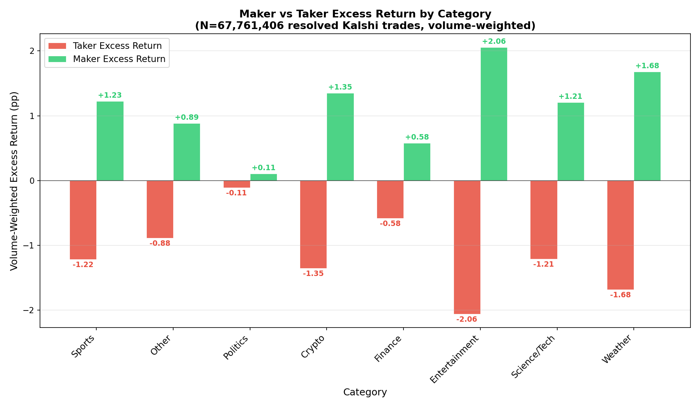
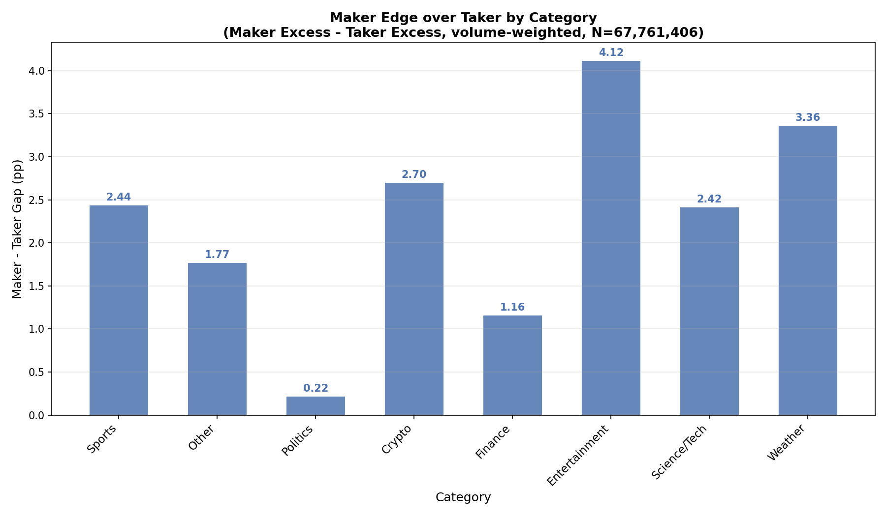

# 2.2: Maker Alpha by Category

## Summary
The maker edge identified in 2.1 varies dramatically by market category. Entertainment markets offer makers the largest excess return at +2.06 pp (4.12 pp gap), while Politics markets show a near-zero maker edge at +0.11 pp (0.22 pp gap). Across all 8 categories spanning 67.8 million resolved Kalshi trades, maker excess return is universally positive, but the magnitude ranges by a factor of nearly 19x. Categories with more retail/casual participation (Entertainment, Weather, Sports) exhibit the widest maker-taker spreads, while categories attracting more sophisticated or informationally-motivated participants (Politics, Finance) show compressed spreads.

## Methodology
We join all trades from `data/kalshi/trades/*.parquet` with resolved markets from `data/kalshi/markets/*.parquet` (status = 'finalized', result in 'yes'/'no'). For each trade:

- **Taker position**: The taker bought the side indicated by `taker_side` at the corresponding price. The taker won if `taker_side == result`.
- **Maker position**: The maker took the opposite side at the complementary price (100 - taker_price). The maker won if `taker_side != result`.
- **Excess return**: Actual win rate minus the average price paid (implied probability).

The event ticker prefix is extracted via `regexp_extract(event_ticker, '^([A-Z0-9]+)', 1)` and mapped to one of 8 categories (Sports, Politics, Crypto, Finance, Weather, Entertainment, Science/Tech, Other) using a keyword-based classifier. Within each category, excess returns are volume-weighted by contract count to avoid over-weighting low-volume prefixes.

## Results

### Maker vs Taker Excess Returns by Category

The grouped bar chart reveals a consistent pattern: in every category, the maker (green) bar is positive and the taker (red) bar is negative, confirming the structural maker advantage is universal. However, the magnitude varies widely:

- **Entertainment** stands out with the widest spread: makers earn +2.06 pp while takers lose -2.06 pp, a total gap of 4.12 pp. This likely reflects the casual, entertainment-motivated nature of participants in Oscar/Emmy/Grammy markets who are less price-sensitive.
- **Weather** is the second-widest at +1.68 pp maker excess (3.36 pp gap), consistent with weather markets attracting retail participants making novelty bets.
- **Crypto** and **Sports** show similar, substantial maker edges of +1.35 pp and +1.23 pp respectively (2.70 and 2.44 pp gaps). Both categories attract high volumes of retail flow.
- **Science/Tech** tracks close to Sports at +1.21 pp (2.42 pp gap).
- **Finance** shows a compressed edge at +0.58 pp (1.16 pp gap), suggesting takers in financial markets are better calibrated -- likely because these markets attract participants with quantitative backgrounds and access to financial data.
- **Politics** is the tightest category with only +0.11 pp maker excess (0.22 pp gap). Political markets attract highly engaged, informationally motivated participants on both sides, leaving very little residual edge for passive makers.

### Maker-Taker Gap by Category

The gap chart orders the categories by trading volume (left to right) and shows the maker-minus-taker spread. The 19x range from Politics (0.22 pp) to Entertainment (4.12 pp) is the key finding: the maker edge is not uniform -- it is a function of taker sophistication.

### Summary Table

| Category | Maker Excess (pp) | Taker Excess (pp) | Gap (pp) | Trades | Maker PnL ($) | Taker PnL ($) |
|---|---|---|---|---|---|---|
| Sports | +1.23 | -1.22 | 2.44 | 34,709,000 | +$97,478,026 | -$96,236,960 |
| Other | +0.89 | -0.88 | 1.77 | 17,686,241 | +$19,872,085 | -$19,826,505 |
| Politics | +0.11 | -0.11 | 0.22 | 3,519,036 | +$13,486,220 | -$13,486,184 |
| Crypto | +1.35 | -1.35 | 2.70 | 6,691,057 | +$6,638,306 | -$6,638,306 |
| Finance | +0.58 | -0.58 | 1.16 | 4,235,543 | +$5,163,389 | -$5,163,389 |
| Entertainment | +2.06 | -2.06 | 4.12 | 578,462 | +$901,459 | -$901,459 |
| Science/Tech | +1.21 | -1.21 | 2.42 | 161,777 | +$72,207 | -$72,207 |
| Weather | +1.68 | -1.68 | 3.36 | 180,290 | +$173,777 | -$173,777 |

Note: Politics has the third-highest PnL despite the narrowest spread because it has the third-largest contract volume (1.57B contracts). The edge is thin but applied to enormous volume.

## Key Findings

- **Maker edge is positive in every category.** The structural advantage of providing liquidity is universal across all market types on Kalshi.
- **The edge varies by 19x across categories.** Entertainment (+2.06 pp) offers makers nearly 19 times the excess return of Politics (+0.11 pp). This variation is the most actionable finding for strategy design.
- **Taker sophistication explains the variation.** Categories attracting casual/retail participants (Entertainment, Weather, Sports) show the widest maker-taker gaps. Categories attracting informed, data-driven participants (Politics, Finance) compress the gap. This is consistent with classical market microstructure theory: the maker edge is adverse selection compensation, and it is largest when takers are least informed.
- **Sports dominates in absolute PnL.** With 34.7M trades and $97.5M in maker PnL, Sports is by far the most important category for market makers in absolute terms, despite not having the widest spread. Volume matters more than edge width.
- **Politics is efficient.** The near-zero maker edge in Politics (0.22 pp) suggests these markets are the most informationally efficient on Kalshi, with takers and makers roughly matched in skill. Market making in Politics would barely cover fees.

## Strategy Implication

A category-aware market-making strategy should allocate capital and quote aggressively based on the category-specific maker edge:

1. **Maximum allocation to Sports**: The combination of high volume (34.7M trades) and a solid 2.44 pp maker-taker gap makes Sports the highest expected-value category in absolute terms. A maker should aim for maximum fill rates here.
2. **Aggressive quoting in Crypto and Entertainment**: These categories offer the widest per-trade edges (2.70 and 4.12 pp gaps respectively). While Entertainment volume is small (578K trades), Crypto is substantial (6.7M trades) and represents the best edge-per-trade opportunity at scale.
3. **Selective participation in Finance**: The 1.16 pp gap is moderate but may be eroded by fees. Makers should be selective, potentially combining with the size segmentation findings from 2.5 (which showed Finance small trades may favor takers).
4. **Avoid or minimize Politics**: The 0.22 pp maker edge is likely insufficient to cover Kalshi's fee structure, meaning net maker returns in Politics may be negative after fees. If making markets in Politics at all, the strategy should quote very tight only on the most liquid contracts.
5. **Weather and Science/Tech as niche opportunities**: Both show strong edges (3.36 and 2.42 pp) but very small volumes (180K and 162K trades). These are worthwhile if the maker can capture flow without excessive inventory risk, but they will not drive portfolio-level returns.

## Limitations
- **Volume-weighted aggregation** may mask variation within categories (e.g., NFL vs NBA within Sports).
- **The keyword classifier** assigns ~26% of trades to "Other", which is a heterogeneous bucket that could contain misclassified markets.
- **No fee adjustment.** Actual maker profitability depends on fee tier; the Politics edge would almost certainly be negative net of fees.
- **No time dimension.** Category edges may shift over time as platform composition evolves (e.g., the 2024 election cycle may have compressed Politics edges as sophisticated participants entered).
- **Survivorship bias**: Only finalized markets with clear yes/no outcomes are included.
- See 2.1 for the overall maker alpha, 2.3 for directional analysis, and 2.5 for trade-size segmentation cross-tabulated with category.
