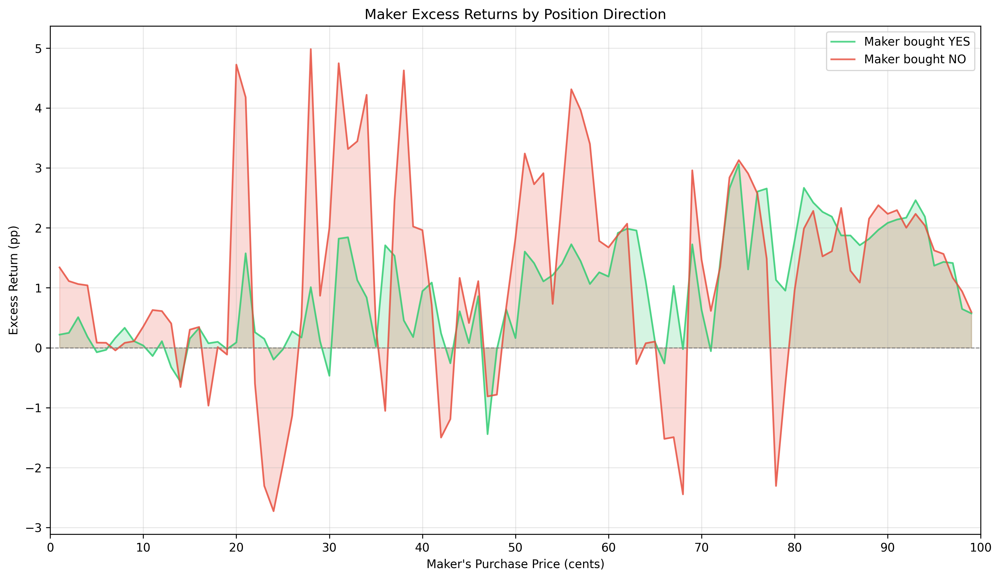

# §2.3: Maker Direction Selection

## Summary
Makers show meaningful directional alpha, particularly on NO positions. Trade-weighted excess returns are +1.28 pp for maker-bought-NO versus +0.77 pp for maker-bought-YES, a difference of +0.52 pp. NO outperforms YES at 59 of 99 price points. The effect is strongest in the 31-40c and 51-60c ranges, where maker NO positions earn +2.53 pp and +2.74 pp respectively, far exceeding their YES-side counterparts. This suggests makers are not merely collecting spread passively -- they selectively position on the NO side, exploiting the well-documented YES bias among takers (see §6.3).

## Methodology
This analysis uses the existing `maker_returns_by_direction` module which:
- For each trade, determines the maker's position:
  - When taker_side='no', maker bought YES at yes_price
  - When taker_side='yes', maker bought NO at no_price
- Computes maker win rate and excess return for each direction at each price point
- Compares maker-bought-YES vs maker-bought-NO performance

## Results

### Maker Returns by Direction

The chart plots maker excess returns (in percentage points) by purchase price for both directions. The red line (maker bought NO) frequently sits above the green line (maker bought YES), especially in the 20-40c and 50-60c regions where the NO excess return spikes to +4-5 pp. Both lines are generally above zero, confirming the overall maker alpha documented in §2.1, but the NO side captures a disproportionate share of the total maker edge. At extreme prices (below 10c and above 90c), the two curves converge, as the binary outcome mechanics compress deviations. The NO line also exhibits higher volatility, with sharper spikes and dips, reflecting the more aggressive selective positioning by makers on that side.

### Direction Comparison
| Price Range | YES Excess (pp) | NO Excess (pp) | Diff (pp) | YES Trades | NO Trades | YES Volume | NO Volume |
|---|---|---|---|---|---|---|---|
| 1-10c | +0.19 | +0.53 | +0.34 | 3,844,245 | 2,816,746 | $47.8M | $49.5M |
| 11-20c | -0.02 | +0.65 | +0.66 | 2,451,537 | 3,059,258 | $81.8M | $131.0M |
| 21-30c | +0.29 | +0.45 | +0.16 | 2,152,512 | 3,731,091 | $114.1M | $229.0M |
| 31-40c | +1.05 | +2.53 | +1.48 | 2,032,602 | 4,868,137 | $157.9M | $397.0M |
| 41-50c | +0.19 | +0.17 | -0.02 | 2,168,761 | 5,803,838 | $229.4M | $629.4M |
| 51-60c | +1.35 | +2.74 | +1.39 | 1,858,600 | 5,880,551 | $242.9M | $716.5M |
| 61-70c | +1.02 | +0.32 | -0.69 | 1,595,910 | 5,567,983 | $241.4M | $759.7M |
| 71-80c | +1.74 | +1.29 | -0.45 | 1,400,671 | 5,140,686 | $246.5M | $825.9M |
| 81-90c | +2.08 | +1.89 | -0.19 | 1,393,266 | 4,936,321 | $299.4M | $1,004.7M |
| 91-99c | +1.35 | +1.57 | +0.22 | 2,070,606 | 4,988,079 | $738.2M | $1,934.8M |

### Aggregate Statistics
- **Trade-weighted maker-YES excess return:** +0.77 pp
- **Trade-weighted maker-NO excess return:** +1.28 pp
- **NO advantage over YES:** +0.52 pp
- **Median YES excess across price points:** +0.95 pp
- **Median NO excess across price points:** +1.16 pp
- **Price points where NO outperforms YES:** 59 / 99
- **Estimated YES-side PnL:** +$27.5M (on $2.4B volume)
- **Estimated NO-side PnL:** +$91.3M (on $6.7B volume)
- **Total maker PnL (both directions):** +$118.8M
- **NO share of total maker PnL:** 77%

### Volume Asymmetry
Makers take 2.25x more NO trades (46.8M) than YES trades (21.0M), and NO-side volume ($6.7B) is 2.78x YES-side volume ($2.4B). This is itself evidence of directional preference: makers disproportionately provide liquidity on the NO side, where taker demand for YES creates a natural flow imbalance. The volume asymmetry is most extreme in the 61-80c range, where NO trades outnumber YES trades by roughly 3.5:1, consistent with takers aggressively buying YES on high-probability outcomes.

## Key Findings
- **Makers have directional alpha, concentrated on NO.** The NO side generates +1.28 pp excess return versus +0.77 pp for YES, and accounts for 77% of estimated maker PnL despite representing 74% of volume. This is not passive accommodation -- makers are selectively more profitable when positioned against the popular YES side.
- **The NO advantage is strongest in mid-probability contracts.** In the 31-40c range, maker NO excess return is +2.53 pp versus +1.05 pp for YES (a +1.48 pp differential). In the 51-60c range, the gap is similar: +2.74 pp vs +1.35 pp (+1.39 pp differential). These are precisely the price levels where YES bias is most exploitable because implied probabilities are moderate and taker overconfidence on YES is most pronounced.
- **YES outperforms NO only in narrow zones.** In the 61-80c range, maker YES positions slightly outperform NO (by 0.45-0.69 pp), possibly because at high implied probabilities the YES bias reverses and contrarian NO takers emerge, giving YES-side makers an edge. At very high prices (81-99c), the two directions converge, with differences under 0.22 pp.

## Strategy Implication
Makers are not just collecting spread -- they have directional views, and those views are systematically correct on the NO side. This has direct implications for §7.1 Filtered Market Making: a strategy that preferentially quotes the NO side (or tilts inventory toward NO) should capture an additional ~0.5 pp of excess return beyond the baseline maker edge. The strongest signal is in the 31-40c and 51-60c ranges, where the NO advantage exceeds 1.3 pp. A directionally-aware market maker could widen YES-side quotes and tighten NO-side quotes in these ranges to attract flow on its preferred side.

The volume asymmetry also suggests that makers are already implicitly doing this: the 2.25x trade imbalance toward NO indicates that makers are more willing to fill YES-seeking takers than NO-seeking takers, accumulating NO inventory that resolves favorably.

## Limitations
- Maker identity is inferred from counterparty logic
- Does not distinguish individual makers
- Price-level comparison may confound direction effects
- Does not account for fees or inventory carrying costs
- The volume asymmetry between YES and NO trades may partly reflect market structure rather than maker choice
- See §6.3 for the overall YES bias that interacts with this analysis
