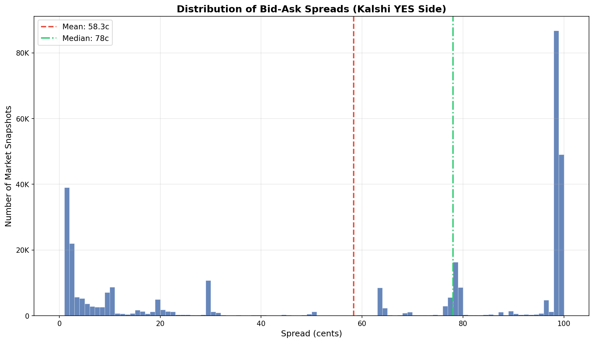
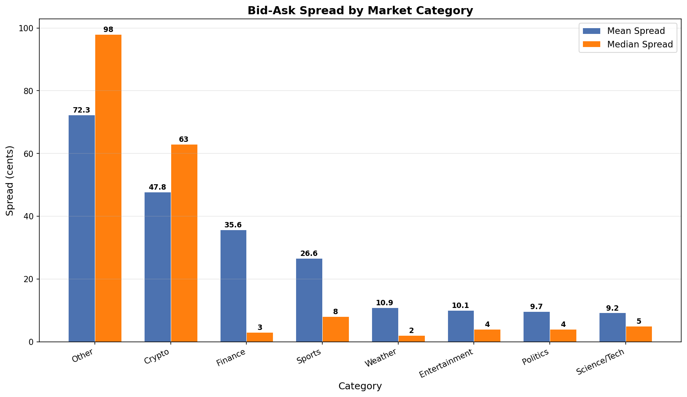

# §2.4: Spread Dynamics

## Summary

Bid-ask spreads on Kalshi prediction markets are strikingly wide: across 334,080 valid market snapshots, the mean spread is 58.3 cents and the median is 78 cents, indicating that a large fraction of listed markets are highly illiquid. However, spread width varies enormously by category --- high-attention segments like Politics (mean 9.7c) and Science/Tech (mean 9.2c) feature tight spreads, while the long tail of low-activity Crypto and Other markets drives the overall average far higher. There is a strong negative correlation (r = -0.53) between spread and log-volume, confirming that liquidity and spread width are tightly linked.

## Methodology

**Data source:** Kalshi market snapshot parquet files (`data/kalshi/markets/*.parquet`), covering 7.68M total rows.

**Filters:** Only snapshots where `yes_bid > 0`, `yes_ask > 0`, both non-null, and `yes_ask >= yes_bid` were retained, yielding 334,080 observations (4.3% of all rows). The large exclusion rate reflects that most Kalshi markets lack active two-sided quotes.

**Spread calculation:** `spread = yes_ask - yes_bid` (in cents, ranging 0--99 on a $1 contract).

**Category extraction:** The leading alphanumeric prefix of `event_ticker` was extracted via regex and mapped to eight thematic groups (Sports, Politics, Crypto, Finance, Weather, Entertainment, Science/Tech, Other).

**Correlation:** Pearson correlation was computed between spread and raw volume, and between spread and log10(volume) for markets with volume > 0.

## Results

### Spread Distribution

The spread distribution is bimodal. A significant cluster of markets has very tight spreads (1 cent) --- 11.7% of all observations fall into the 1-cent bin, and 22.7% have spreads of 5 cents or less. At the opposite extreme, a large mass of markets sits near the maximum possible spread (98--99 cents), representing markets with minimal liquidity where the bid is near zero and the ask is near par. The 75th percentile is 98 cents, meaning over a quarter of quoted markets have spreads above 98c.

| Statistic | Value |
|-----------|-------|
| Mean | 58.3c |
| Median | 78.0c |
| Std Dev | 42.0c |
| 25th Percentile | 8.0c |
| 75th Percentile | 98.0c |
| 95th Percentile | 99.0c |
| % at 1c | 11.7% |
| % at 5c or less | 22.7% |

### Spread by Category

Category-level analysis reveals a dramatic stratification. High-profile categories attract more market makers and tighter spreads:

| Category | Mean Spread | Median Spread | N Markets | Mean Volume |
|----------|------------|---------------|-----------|-------------|
| Science/Tech | 9.2c | 5c | 338 | 26,742 |
| Politics | 9.7c | 4c | 1,893 | 254,494 |
| Entertainment | 10.1c | 4c | 632 | 31,249 |
| Weather | 10.9c | 2c | 909 | 7,132 |
| Sports | 26.6c | 8c | 6,916 | 29,134 |
| Finance | 35.7c | 3c | 25,319 | 5,266 |
| Crypto | 47.8c | 63c | 130,605 | 1,310 |
| Other | 72.3c | 98c | 167,468 | 4,946 |

Politics markets stand out with both the tightest spreads (median 4c) and by far the highest mean volume (254K contracts), consistent with these being the most liquid and competitive segment on the platform. Weather has the lowest median spread (2c) despite moderate volume, possibly reflecting simpler binary outcomes that are easier to price.

The Finance category shows an interesting split: the median spread is very tight (3c) but the mean is 35.7c, suggesting a bimodal distribution where a subset of finance markets (likely flagship CPI/Fed rate markets) are extremely liquid while many others are dormant.

Crypto and Other together account for 89% of all observations, and their wide spreads (47.8c and 72.3c mean, respectively) dominate the overall distribution. These categories feature many low-volume or zero-volume markets with one-sided or near-absent order books.

### Spread vs. Volume Correlation

The Pearson correlation between spread and raw volume is weak at r = -0.017, largely because volume is extremely right-skewed. Using log10(volume) for the 90,357 markets with volume > 0 reveals a much stronger relationship: r = -0.526. This confirms the intuition that more actively traded markets have substantially tighter spreads, but the relationship is logarithmic --- each order-of-magnitude increase in volume is associated with a roughly proportional decrease in spread width.

## Key Findings

- **Wide spreads dominate:** The majority of Kalshi markets have very wide spreads (median 78c), reflecting that most listed markets have minimal active liquidity. Only about 23% of markets with active two-sided quotes have spreads of 5 cents or fewer.
- **Category stratification is extreme:** Mean spreads range from 9.2c (Science/Tech) to 72.3c (Other), a factor of nearly 8x. High-profile categories (Politics, Entertainment, Science/Tech) consistently show the tightest spreads and highest volumes.
- **Spread tracks log-volume:** There is a strong negative correlation (r = -0.53) between spread and log-volume, meaning market-making viability improves dramatically in higher-volume markets. The relationship is nonlinear: small increases in volume at the low end have outsized effects on spread.

## Strategy Implication

For a market-making strategy, these results suggest a clear segmentation approach:

1. **Focus on high-volume categories first.** Politics, Sports, Entertainment, and Science/Tech markets offer the tightest spreads and highest volumes, meaning they are already competitive --- but also where edge from superior pricing or faster execution can be monetized most efficiently.

2. **The long tail is an opportunity and a trap.** Wide spreads in Crypto/Other markets represent large potential per-trade margins, but the zero or near-zero volume in most of these markets means fills are rare. A selective approach targeting wide-spread markets that show *emerging* volume could capture the transition from illiquid to liquid.

3. **Spread-based filtering is essential.** Any automated strategy should filter markets by minimum spread width and minimum volume. Markets with spreads above 50c and zero volume are effectively dead and should be excluded from active market-making consideration.

4. **The Finance bimodality is exploitable.** The split between tight-spread flagship finance markets and wide-spread tail markets suggests that less-followed finance events may be underserved by market makers. Identifying these before they attract volume could provide early-mover advantage.

## Limitations

- **Snapshot data, not time-series.** Each row is a point-in-time snapshot of the order book top-of-book. Spread dynamics over time (e.g., spread tightening as an event approaches) are not captured here and would require temporal analysis.
- **No depth information.** We observe only the best bid and best ask, not the full order book depth. A 1-cent spread with $5 behind it is very different from a 1-cent spread with $50,000 behind it.
- **Survivorship and selection bias.** Only markets with both `yes_bid > 0` and `yes_ask > 0` are included (4.3% of all rows). The excluded 95.7% of rows represent either one-sided or empty books, which means our analysis already captures only the more liquid subset.
- **Category grouping is approximate.** The regex-based prefix extraction and keyword matching may misclassify some event tickers, particularly for less common categories.
- **Spread values are in cents on a $1 contract.** A 10-cent spread on a market priced at 50c represents a 20% round-trip cost, whereas the same 10-cent spread on a market priced at 95c represents only about 10.5%. Relative spread (as a fraction of mid-price) may be more relevant for execution cost analysis.
