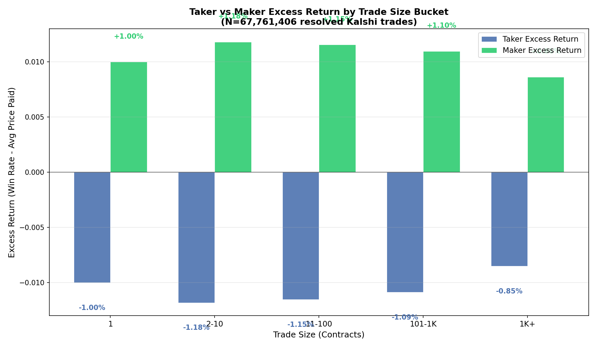
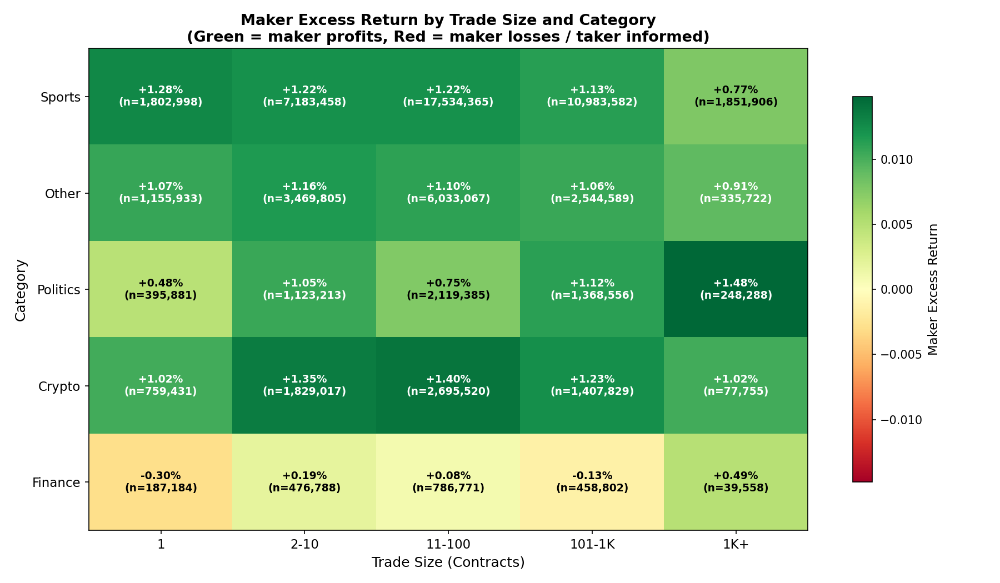

# §2.5: Trade Size Segmentation

## Summary
Makers earn positive excess returns against takers of **all** trade sizes on Kalshi, confirming a persistent structural edge for liquidity providers. The maker advantage is remarkably stable across size buckets (ranging from +0.86% to +1.18%), with mid-sized trades (2-10 and 11-100 contracts) generating the highest maker excess returns. Contrary to the "smart money" hypothesis, larger trades are **not** more informed --- in fact, the very largest trades (1K+) show the *smallest* taker deficit, suggesting that large takers are marginally better calibrated than small ones.

## Methodology
We segmented 67.8 million resolved Kalshi trades into five size buckets based on contract count:
- **1 contract**: Single-contract trades (6.5% of trades, <0.1% of contract volume)
- **2-10 contracts**: Small multi-contract (21.1% of trades, 0.5% of volume)
- **11-100 contracts**: Medium-sized (43.6% of trades, 8.1% of volume)
- **101-1K contracts**: Large trades (25.0% of trades, 34.2% of volume)
- **1K+ contracts**: Institutional/whale (3.8% of trades, 57.2% of volume)

For each bucket, we computed:
- **Taker excess return**: Taker actual win rate minus the average price paid (expected win rate under calibration)
- **Maker excess return**: Maker actual win rate minus the average price received

We then cross-tabulated maker excess returns with the top 5 market categories by volume (Sports, Other, Politics, Crypto, Finance) using an inline keyword-based category classifier applied to the event ticker prefix.

## Results

### Excess Returns by Trade Size

Makers earn between +0.86% and +1.18% excess return across all five size buckets. The maker edge peaks in the 2-10 contract bucket (+1.18%) and is lowest for the largest trades of 1K+ contracts (+0.86%). The taker side mirrors this exactly: takers lose between -0.85% and -1.18% per trade after accounting for the price paid. The pattern is roughly U-shaped for takers, with the worst performance in the 2-10 contract range and slight improvement at both extremes (1-contract and 1K+ trades).

### Size x Category Cross-Tabulation

The heatmap reveals meaningful variation across categories:

- **Politics + 1K+** is the single richest cell for makers: +1.48% excess return on 248K trades. Large political bettors appear to be the least informed among big traders.
- **Sports** shows consistently strong maker edges across all sizes (1.13-1.28%), with the edge declining for the largest trades (+0.77% at 1K+).
- **Crypto** shows an unusual pattern: makers earn the most at medium sizes (11-100: +1.40%) but the edge compresses at 1K+ (+1.02%) and 101-1K (+1.23%).
- **Finance** is the most interesting outlier: makers actually *lose* at small sizes (1-contract: -0.30%, 101-1K: -0.13%), but earn +0.49% at 1K+. This suggests small Finance takers may be better informed (or that prices in Finance markets are well-calibrated for retail), while large Finance takers overpay.
- **Other** maintains a steady ~1% maker edge across all sizes.

### Summary Table
| Size Bucket | Taker Excess | Maker Excess | Trades | Contracts |
|---|---|---|---|---|
| 1 | -1.00% | +1.00% | 4,408,142 | 4,408,142 |
| 2-10 | -1.18% | +1.18% | 14,325,837 | 85,846,860 |
| 11-100 | -1.15% | +1.15% | 29,546,396 | 1,388,719,742 |
| 101-1K | -1.09% | +1.10% | 16,916,692 | 5,894,597,700 |
| 1K+ | -0.85% | +0.86% | 2,564,339 | 9,857,035,174 |

## Key Findings
- **Makers earn positive excess returns against ALL trade sizes.** The structural advantage of providing liquidity is universal, not limited to any particular taker cohort.
- **Mid-sized trades (2-100 contracts) are the most profitable for makers.** The 2-10 contract bucket yields the highest maker excess at +1.18%, likely representing less-sophisticated retail traders taking multiple contracts.
- **The largest trades (1K+) are the least profitable for makers.** At +0.86% maker excess, whale trades show the narrowest spread, consistent with large traders being marginally better informed or having more price-sensitive execution.
- **Category matters more than size for identifying edge.** Politics + large trades and Sports + medium trades represent the most fertile ground for makers. Finance is an anomaly where small takers may actually have an edge.

## Strategy Implication
A market-making strategy should **prioritize filling orders in the 2-100 contract range**, especially in Sports and Politics categories, where the maker edge is 1.1-1.5%. For Finance markets, makers should be cautious with small trades (1-10 contracts) where the edge is thin or negative, but can lean into large Finance trades (1K+) where takers appear less informed. The 1K+ bucket still offers positive expected value overall, but the compressed spread suggests that quoting wider against very large orders adds less value than improving fill rates on medium-sized flow. The cross-category analysis suggests that **category-aware sizing of maker quotes** (tighter in Finance for small trades, wider in Politics for large trades) could improve overall returns.

## Limitations
- **No time dimension.** The analysis aggregates across all time periods; maker edges may vary with market maturity, volatility regimes, or platform growth phases.
- **Count-based bucketing only.** Using contract count rather than notional value means a 100-contract trade at 5 cents and one at 95 cents are treated identically, despite very different economic sizes.
- **Category classifier is keyword-based.** The inline `get_group()` function relies on prefix matching, which may misclassify some event tickers, especially those in the "Other" bucket (which is the second-largest category).
- **Survivor bias.** Only finalized markets with a clear yes/no result are included; cancelled or ambiguous markets are excluded.
- **No spread or fee adjustment.** Taker excess returns are computed before Kalshi's fee schedule, so actual taker P&L may differ from the figures shown.
