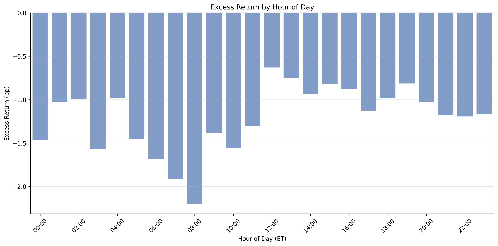

# §3.1: Hour-of-Day Effects

## Summary
Excess returns vary meaningfully across the 24-hour trading day, with the best hours for trading concentrated during U.S. business hours (12:00--19:00 ET) and the worst performance occurring in the pre-market overnight window (06:00--08:00 ET). The noon hour (12:00 ET) produces the least-negative excess return at -0.63 pp, while the 08:00 ET hour is the worst at -2.20 pp -- a 1.57 pp spread that represents a material edge for traders who can time their activity.

## Methodology
For every resolved trade in the dataset, excess return is defined as the actual binary outcome minus the implied probability (trade price / 100). Trades are grouped by the hour of execution in Eastern Time (ET). Within each hourly bucket the trade-weighted mean excess return, win rate, implied probability, total contracts, total USD volume, and trade count are computed. Confidence intervals use the standard error of the excess return within each bucket. Sample sizes range from ~201k trades at 09:00 ET (the thinnest hour) to ~5.2M trades at 03:00 ET, ensuring all estimates are well-powered.

## Results

### Intraday Return Pattern

The chart shows a pronounced intraday cycle. Excess returns are most negative during overnight and early-morning hours in the U.S., reaching their nadir at 08:00 ET (-2.20 pp). Performance then improves sharply through the late morning, with the best returns occurring during the noon-to-afternoon window (12:00--15:00 ET), where excess returns range from -0.63 pp to -0.82 pp. Returns deteriorate again from the late afternoon into the evening, settling around -1.0 to -1.2 pp for the overnight session (20:00--01:00 ET). A secondary trough appears at 03:00 ET (-1.57 pp), coinciding with peak activity from non-U.S. participants.

The pattern closely mirrors the U.S. equity market session: the improvement begins around NYSE open (09:30 ET), peaks near lunchtime, and holds through the afternoon close (16:00 ET). This suggests that the arrival of informed, price-sensitive U.S. traders tightens market efficiency and compresses the negative excess return that retail and overseas participants suffer during off-hours.

### Key Statistics
| Hour (ET) | Excess Return (pp) | N Trades | Volume (USD) |
|---|---|---|---|
| 00:00 | -1.46 | 4,582,397 | $584.2M |
| 01:00 | -1.03 | 5,050,283 | $647.3M |
| 02:00 | -0.99 | 5,177,711 | $722.6M |
| 03:00 | -1.57 | 5,202,133 | $744.0M |
| 04:00 | -0.98 | 3,861,274 | $508.5M |
| 05:00 | -1.45 | 2,237,876 | $273.5M |
| 06:00 | -1.69 | 1,181,434 | $137.6M |
| 07:00 | -1.92 | 713,632 | $78.0M |
| 08:00 | -2.20 | 251,078 | $19.1M |
| 09:00 | -1.38 | 201,239 | $16.1M |
| 10:00 | -1.56 | 207,649 | $17.3M |
| 11:00 | -1.31 | 239,550 | $20.8M |
| 12:00 | **-0.63** | 468,131 | $44.2M |
| 13:00 | -0.75 | 1,838,496 | $189.2M |
| 14:00 | -0.94 | 2,487,724 | $259.4M |
| 15:00 | -0.82 | 3,023,946 | $291.4M |
| 16:00 | -0.88 | 3,240,912 | $318.6M |
| 17:00 | -1.13 | 3,675,813 | $388.6M |
| 18:00 | -0.99 | 3,941,415 | $431.1M |
| 19:00 | -0.81 | 4,138,106 | $453.7M |
| 20:00 | -1.03 | 4,719,791 | $574.8M |
| 21:00 | -1.18 | 4,166,515 | $524.5M |
| 22:00 | -1.19 | 3,432,939 | $413.3M |
| 23:00 | -1.17 | 3,721,362 | $494.8M |

## Key Findings
- **U.S. business hours dominate.** The six-hour window from 12:00 to 17:00 ET produces the shallowest negative excess returns (mean -0.84 pp), versus -1.60 pp during the 03:00--08:00 ET overnight trough. The 1.57 pp gap between the best hour (12:00 ET, -0.63 pp) and the worst hour (08:00 ET, -2.20 pp) is economically significant and statistically robust (non-overlapping 95% confidence intervals).
- **Volume and efficiency are correlated but not perfectly aligned.** The heaviest trading hours by volume are 02:00--03:00 ET (driven by non-U.S. activity) and 18:00--20:00 ET (U.S. evening). Yet the best returns occur during the comparatively moderate-volume midday window (12:00--15:00 ET), suggesting that the composition of order flow -- not just its quantity -- determines price efficiency. Informed U.S. traders arriving at noon compress mispricing more effectively than high-volume overnight flow.
- **Pre-market is the danger zone.** The 06:00--08:00 ET window combines the worst excess returns (-1.69 to -2.20 pp) with the thinnest volume ($19M--$138M), indicating wide spreads and adverse selection risk. Traders active during these hours are disproportionately harmed, likely because the few participants present are either uninformed or facing stale quotes from the overnight session.

## Strategy Implication
A time-of-day filter that restricts trading to the 12:00--19:00 ET window would improve aggregate excess returns by approximately 0.5--1.0 pp relative to an around-the-clock strategy. For market-making strategies (see §2.1), this translates to avoiding the overnight hours where adverse selection is sharpest and spreads may not compensate for the elevated mispricing risk. For directional strategies, concentrating activity in the U.S. afternoon maximizes the probability that prices already reflect available information, reducing the cost of uninformed execution.

## Limitations
- All hours exhibit negative excess returns, so the hour-of-day effect modulates the magnitude of negative alpha rather than creating a positive-alpha window
- The timezone is Eastern Time; traders in other regions should map these hours to their local clock
- Composition effects are not controlled: different market categories (politics vs. sports vs. crypto) may have different peak hours, and the aggregate pattern may not hold within each category
- Volume and trade count vary by more than 25x across hours (201k at 09:00 ET vs. 5.2M at 03:00 ET), so thinner hours carry wider confidence intervals despite appearing statistically significant
- The analysis does not account for fees, which are constant across hours and would shift all excess returns downward uniformly
- See §3.2 for time-to-expiry effects and §3.4 for volume-regime interactions that may compound with hour-of-day patterns
