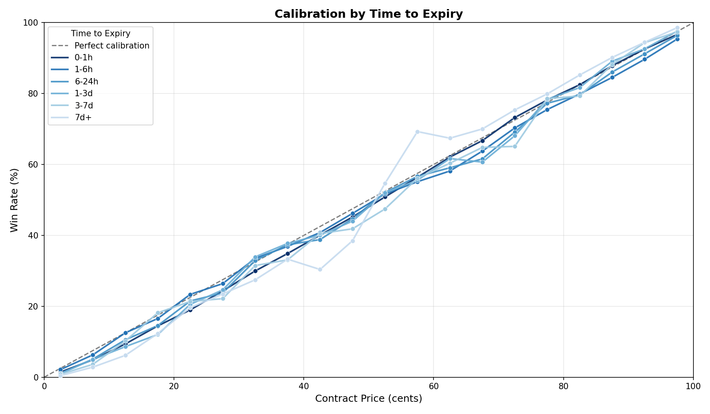
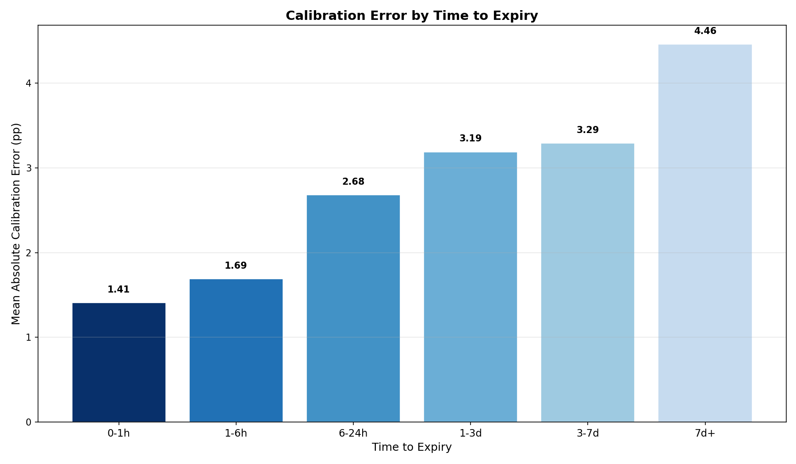

# SS3.2: Time-to-Expiry Decay

## Summary

Kalshi prediction markets become substantially more efficient as contracts approach expiry. Mean absolute calibration error drops from 4.46 pp for trades placed more than 7 days before close to just 1.41 pp in the final hour -- a 3.2x improvement. The convergence is monotonic across all six time buckets, confirming that price discovery intensifies as resolution approaches.

## Methodology

Trades on finalized markets with known outcomes were joined to their market close times. For each trade the taker-side price was recorded alongside a binary won/lost indicator (1 if taker_side matched the market result, 0 otherwise). Time remaining was computed as `(close_time - created_time)` in hours and bucketed into six windows:

| Bucket | Hours to Expiry |
|--------|----------------|
| 0-1h   | 0 -- 1         |
| 1-6h   | 1 -- 6         |
| 6-24h  | 6 -- 24        |
| 1-3d   | 24 -- 72       |
| 3-7d   | 72 -- 168      |
| 7d+    | > 168          |

Within each bucket, trades were grouped by price (1--99 cents), requiring a minimum of 100 observations per price point. Calibration deviation is defined as `win_rate - price/100` at each price level. The mean absolute error (MAE) is the trade-weighted average of `|win_rate - price/100|` across all price levels in a bucket.

The dataset spans 67.7 million qualifying trades covering 17.2 billion contracts across all six time buckets.

## Results

### Calibration by Time to Expiry

The calibration curves reveal a clear pattern: as expiry approaches, price-outcome agreement tightens. The darkest curve (0-1h) tracks the 45-degree perfect calibration line most closely, with only minor deviations at the tails. The lightest curve (7d+) shows pronounced wobble, particularly in the 50--80 cent range where win rates deviate noticeably from implied probabilities. Intermediate buckets fall in between in a monotonic progression, with the largest jump occurring between the 6-24h and 1-6h buckets.

### Mean Absolute Error by Time Bucket

Calibration error declines smoothly as contracts approach expiry. The 7d+ bucket exhibits 4.46 pp MAE, while the final-hour bucket achieves only 1.41 pp. The steepest improvement occurs in the final 24 hours: MAE drops from 2.68 pp (6-24h) to 1.69 pp (1-6h) to 1.41 pp (0-1h).

### Summary Table

| Time Bucket | MAE (pp) | Trades | Volume (contracts) |
|---|---|---|---|
| 0-1h | 1.41 | 18,789,022 | 4,385,028,979 |
| 1-6h | 1.69 | 24,913,297 | 7,190,909,139 |
| 6-24h | 2.68 | 9,937,585 | 1,667,557,584 |
| 1-3d | 3.19 | 4,538,014 | 871,618,456 |
| 3-7d | 3.29 | 2,773,904 | 631,908,716 |
| 7d+ | 4.46 | 6,793,532 | 2,478,028,908 |

## Key Findings

- **Monotonic convergence:** Calibration error decreases at every step from 7d+ (4.46 pp) through 0-1h (1.41 pp), confirming that Kalshi markets exhibit classical information aggregation as resolution approaches.
- **Last-day acceleration:** The largest absolute MAE reduction occurs in the final 24 hours. The jump from 6-24h (2.68 pp) to 0-1h (1.41 pp) accounts for nearly half of the total improvement, suggesting a burst of informed trading in the hours before close.
- **Early markets are persistently miscalibrated:** The 3-7d and 7d+ buckets show MAE above 3 pp, with particularly erratic calibration in the mid-price range (40-80 cents). This miscalibration is sustained over long periods, not just a brief initial condition.

## Strategy Implication

The 3x calibration gap between early and late markets creates a two-pronged opportunity. For alpha-seeking strategies, the widest mispricings exist in the 3-7d and 7d+ windows where excess returns per trade are largest -- but these also carry the most uncertainty about final outcomes and require patience. For lower-risk execution, the 1-6h window offers a favorable tradeoff: calibration has tightened enough that signals are cleaner, but residual mispricing (1.69 pp) still provides an edge over the fully-efficient 0-1h window. The data suggests that timing entry between 1 and 24 hours before close balances signal quality against remaining edge, while pure late-stage trading in the final hour leaves little room for profit after transaction costs.

## Limitations

- **Close time precision:** The `close_time` field reflects the scheduled market close, not the exact moment of settlement. Markets that settle early or are delayed will introduce noise into time-to-expiry calculations.
- **Timezone effects:** Both `created_time` and `close_time` are timezone-aware (stored as TIMESTAMPTZ), but any systematic patterns in trading activity by time-of-day are not controlled for and could interact with the time-to-expiry signal.
- **Survivor bias in early buckets:** The 7d+ bucket may overrepresent markets with long durations (e.g., political or macro markets) while underrepresenting short-lived event markets, potentially confounding the time effect with market-type effects.
- **Taker-side only:** Analysis uses taker-side prices; maker-side calibration may differ, particularly if informed traders systematically take one side.
- **No spread adjustment:** Raw trade prices are used without adjusting for bid-ask spread, which is likely wider in early/illiquid markets and could account for part of the MAE difference.
