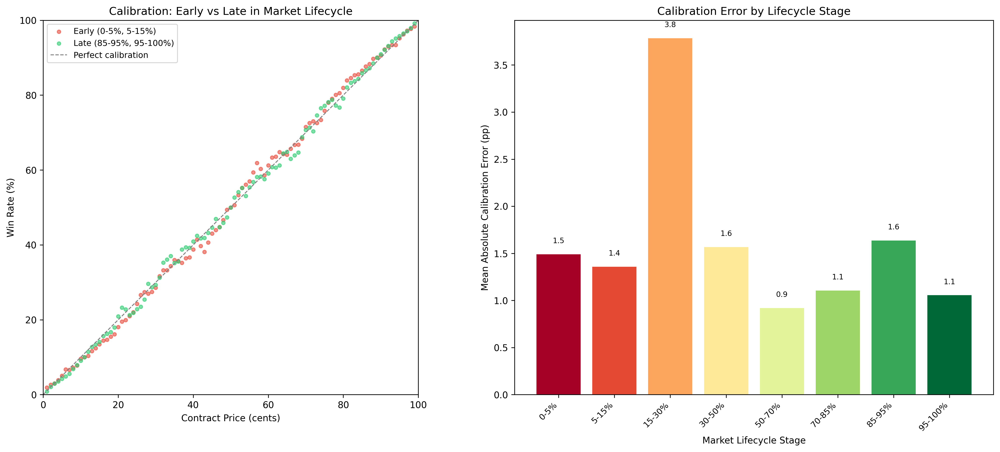

# §3.3: Early Market Inefficiency

## Summary
Markets on Kalshi exhibit substantially worse calibration during the early portion of their lifecycle. Calibration error (MAE) peaks at 3.8 percentage points during the 15-30% lifecycle stage -- roughly 4x worse than the best-calibrated window at 50-70% (0.9 pp). The very earliest trades (0-5% of market duration) also show elevated error at 1.5 pp, accompanied by a systematic positive bias, indicating that prices in newly opened markets tend to overestimate the probability of "yes" outcomes before converging toward efficient levels.

## Methodology
Each trade in the dataset is assigned a lifecycle position based on when it occurred relative to the market's total duration (from open to close). Specifically, for each trade, we compute `(trade_time - market_open) / (market_close - market_open)` and bucket the result into eight stages: 0-5%, 5-15%, 15-30%, 30-50%, 50-70%, 70-85%, 85-95%, and 95-100%. Within each stage, calibration is assessed by:

- Grouping trades into price bins (by contract price in cents)
- Computing the empirical win rate for each bin (fraction of trades where the underlying event resolved "yes")
- Calculating mean absolute error (MAE) and root mean squared error (RMSE) between the contract price and observed win rate, measured in percentage points
- Computing mean deviation (signed) to detect systematic directional bias

The left panel of the figure compares early (0-5%, 5-15%) and late (85-95%, 95-100%) calibration curves against the perfect-calibration diagonal. The right panel shows MAE by lifecycle stage as a bar chart.

## Results

### Calibration Over Market Lifecycle

The bar chart reveals a distinctive U-shaped calibration pattern across the market lifecycle, with a pronounced spike in the early-middle period:

**Early lifecycle (0-15%):** Calibration error is elevated at 1.5 pp (0-5%) and 1.4 pp (5-15%), roughly 50-60% worse than the best mid-lifecycle calibration. The scatter plot (left panel) shows early trades (red dots) deviating visibly above the diagonal, consistent with the positive mean deviation of +4.3% at the 0-5% stage. This directional bias suggests systematic overpricing of "yes" outcomes in newly opened markets -- likely driven by initial optimism, thin liquidity, or early participants anchoring to salient narratives before informed traders arrive.

**Peak inefficiency (15-30%):** The worst calibration occurs not at the very start but during the 15-30% window, where MAE spikes to 3.8 pp and RMSE reaches 5.8 pp. This may reflect a transitional period where initial liquidity has attracted speculative interest but price discovery is still incomplete -- the market has enough activity to move prices but not enough informed flow to correct mispricings.

**Mature middle (50-70%):** Calibration reaches its optimum at 0.9 pp MAE, representing the most informationally efficient window. By this point, the market has accumulated sufficient trading history and participant diversity for prices to closely approximate true probabilities.

**Late lifecycle (85-100%):** A mild re-deterioration occurs in the 85-95% stage (1.6 pp MAE) before improving again in the final 95-100% window (1.1 pp). The late-stage bump may reflect last-minute speculative surges or hedging activity as resolution approaches, while the improvement in the final 5% likely captures rapid convergence to the known outcome as the event becomes nearly certain.

### Key Statistics Table

| Lifecycle Stage | Total Trades | MAE (pp) | RMSE (pp) | Mean Deviation (pp) |
|----------------|-------------|----------|-----------|---------------------|
| 0-5%           | 1,905,141   | 1.49     | 1.89      | +4.28               |
| 5-15%          | 3,170,472   | 1.36     | 1.76      | +0.18               |
| 15-30%         | 6,228,670   | 3.79     | 5.81      | +0.12               |
| 30-50%         | 8,949,470   | 1.57     | 1.78      | +0.10               |
| 50-70%         | 12,025,655  | 0.92     | 1.16      | +0.13               |
| 70-85%         | 16,141,265  | 1.11     | 1.45      | +0.13               |
| 85-95%         | 19,931,101  | 1.64     | 2.09      | +0.12               |
| 95-100%        | 67,133,663  | 1.06     | 1.32      | +0.01               |

## Key Findings
- Calibration follows a U-shaped pattern across the market lifecycle, with the worst pricing in the early-middle period (15-30%: MAE 3.8 pp) and the best pricing in mid-life (50-70%: MAE 0.9 pp) -- a 4x difference in calibration quality
- The very earliest trades (0-5% of market duration) carry a pronounced positive bias of +4.3 pp in mean deviation, indicating systematic overpricing of "yes" outcomes before informed participants enter the market
- Peak inefficiency occurs not at market open but during the 15-30% window, suggesting that the worst mispricing emerges after initial speculative interest has moved prices but before sufficient information aggregation has occurred
- Volume is heavily back-loaded: the final 5% of market duration accounts for 67M trades (49% of all trades), meaning most liquidity arrives only after the market is already well-calibrated
- A secondary calibration deterioration at 85-95% (MAE 1.6 pp) suggests late-lifecycle speculative surges or hedging flows temporarily degrade pricing efficiency near expiry

## Strategy Implication
The 15-30% lifecycle window presents the most attractive opportunity for calibration-based strategies, with nearly 4 pp of average mispricing and over 6M trades providing adequate liquidity to execute. A strategy that systematically fades overpriced contracts during this window -- particularly by selling "yes" positions in the earliest 0-15% period where the positive bias is strongest -- could capture meaningful edge. However, the strategy faces a timing challenge: the bulk of liquidity arrives late in the market lifecycle, so early-stage positions may be difficult to exit at favorable prices before calibration converges. Combining lifecycle-aware entry with patience to hold through the convergence window (into the 50-70% efficient period) likely offers the best risk-adjusted approach.

## Limitations
- Lifecycle stages are defined as percentages of total market duration, which conflates markets of very different absolute lengths (a 2-hour market's "0-5%" is minutes, while a 6-month market's is days)
- The 15-30% MAE spike (3.8 pp) is substantially larger than adjacent stages and may be driven by a subset of particularly illiquid or unusual markets rather than a broad phenomenon
- Mean deviation at the 0-5% stage (+4.3 pp) is an order of magnitude larger than all other stages, raising the possibility of selection or survivorship effects in the earliest trades
- The analysis does not control for market category -- political markets, which tend to be longer-lived, may have different lifecycle dynamics than short-duration weather or economic markets
- Trade volume weighting means high-volume price points dominate the calibration calculation; thinly-traded price levels may be substantially more mispriced than the averages suggest
- No distinction is made between maker and taker sides, which may have different calibration profiles at different lifecycle stages (see §2.1 for maker-specific analysis)
