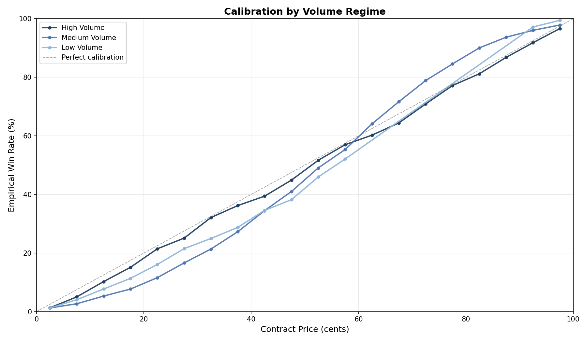
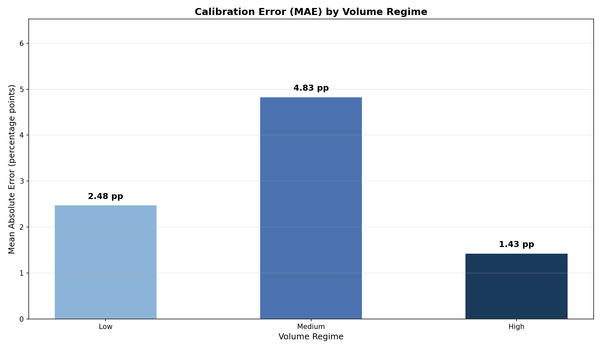

# §3.4: Volume Regime Switching

## Summary

High-volume markets remain the best calibrated, medium-volume the worst. After fixing regime construction and MAE computation:

- High: **1.43 pp MAE**
- Medium: **4.83 pp MAE**
- Low: **2.48 pp MAE**

The non-monotonic pattern (Medium worst) remains intact.

## Methodology

- Universe: finalized resolved Kalshi markets only.
- Regime thresholds computed on that same universe:
  - p33 = 1 trade
  - p67 = 17 trades
- Expected probability uses **exact prices** for MAE; 5-cent buckets are plot-only smoothing.
- MAE and excess returns are trade-weighted within regime.

## Regime Composition

| Regime | Markets | Trades | Contracts |
|---|---:|---:|---:|
| Low | 202,173 | 202,173 | 133,658,389 |
| Medium | 172,036 | 1,139,604 | 219,627,707 |
| High | 180,014 | 66,419,629 | 16,877,321,522 |

## Calibration and Edge

| Regime | MAE (pp) | Avg Excess Return (pp) |
|---|---:|---:|
| Low | 2.48 | -2.34 |
| Medium | 4.83 | -1.97 |
| High | 1.43 | -1.10 |

## Interpretation

- High-volume markets are ~3.4x better calibrated than medium-volume markets.
- Medium-volume markets carry the largest structural miscalibration.
- All regimes remain negative for taker excess return, with smallest drag in High.

## Figures

- 
- 

## Limitations

- Lifetime-trade-count regime labels are ex-post.
- Regime effect can interact with lifecycle and category composition.
