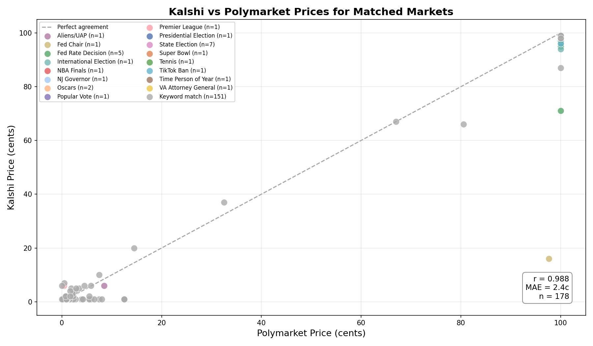
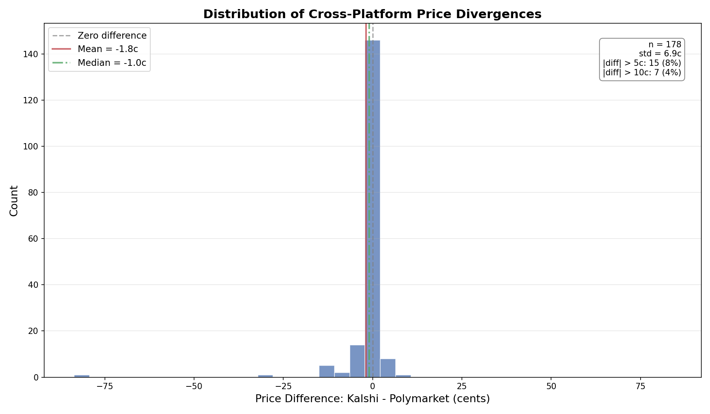

# §4.1: Kalshi-Polymarket Divergence

## Summary

Across 178 high-confidence matched market pairs, Kalshi and Polymarket prices are remarkably well-aligned: the median divergence is just -1.0 cent (Kalshi lower), the mean absolute error is 2.4 cents, and 92% of pairs agree within 5 cents. However, a small number of structurally mismatched pairs -- particularly in Fed policy and forward-looking markets -- exhibit divergences exceeding 10 cents, driven by differences in contract specification rather than true arbitrage opportunity. Cross-platform arbitrage is not viable at scale given the tight typical spread, but selective monitoring of newly-listed or specification-ambiguous markets may surface occasional mispricings.

## Methodology

We matched markets across Kalshi and Polymarket using two complementary approaches. First, **targeted matching**: 37 hand-curated regex patterns for known overlapping events (presidential election, Fed rate decisions, Super Bowl, state elections, Oscars, etc.), yielding 30 matched pairs after filtering for markets present on both platforms. Second, **automated keyword matching**: we extracted keywords from market titles (excluding stop words and generic terms), built an inverted index over the top 5,000 Kalshi and 10,000 Polymarket markets by volume, and matched pairs sharing at least 3 keywords with a Jaccard similarity of 0.60 or higher. This produced 333 quality-filtered keyword matches.

After deduplication and combining both methods, we obtained 285 unique matched pairs. We then applied a quality filter to remove 107 "likely different market" pairs where one side was settled (price 0--2c or 98--100c) and the other was not -- indicating temporal or specification mismatches rather than true cross-platform disagreement. This left **178 good-quality matched pairs** for analysis. All prices are `last_price` in cents (0--100 scale). The source data comprised 7.68M Kalshi market snapshots (337,423 after filtering for non-parlay, price > 0, volume > 100) and 408,863 Polymarket snapshots (103,840 after filtering for volume > 1,000 and valid prices).

## Results

### Price Agreement Scatter

The scatter plot shows matched market prices clustered tightly along the 45-degree line of perfect agreement. The Pearson correlation is **r = 0.988**, indicating near-perfect linear agreement across the full 0--100 cent price range. Most data points hug the diagonal, with only a handful of visible outliers. The densest clusters appear at the extremes (near 0c and near 100c), reflecting the large number of settled or near-certain markets in the sample. Mid-range prices (20--80c) are less common but still track closely. The one dramatic outlier is the Kevin Warsh Fed Chair nomination (Kalshi 16c vs. Polymarket 98c), which is driven by a contract specification difference rather than a genuine pricing disagreement.

### Distribution of Price Divergences

The histogram of price differences (Kalshi minus Polymarket) is sharply concentrated near zero, with a slight negative skew. Key statistics:

- **Mean:** -1.84c (Kalshi systematically slightly lower)
- **Median:** -1.0c
- **Standard deviation:** 6.88c
- **Within 5c:** 163 pairs (92%)
- **Within 10c:** 171 pairs (96%)
- **|diff| > 10c:** 7 pairs (4%)

The negative mean reflects a structural pattern: Kalshi `last_price` on resolved or near-resolved markets often sits at 98--99c rather than the full 100c that Polymarket reports, likely due to differences in settlement mechanics and last-trade timing.

### Key Matched Pairs with Notable Divergences

The table below shows the matched pairs with the largest absolute price differences, which are the most relevant for understanding when and why the platforms disagree.

| Kalshi Market | Polymarket Market | Kalshi | Poly | Diff |
|---|---|---|---|---|
| Will Trump next nominate Kevin Warsh as Fed Chair? | Will Trump nominate Kevin Warsh as the next Fed chair? | 16.0c | 97.7c | -81.7c |
| Fed Reserve Cut rates by 25bps Dec 2025? | Fed decreases interest rates by 25 bps after Dec 2025? | 71.0c | 100.0c | -29.0c |
| Will Arsenal win the English Premier League? | Will Arsenal win the 2025--26 English Premier League? | 66.0c | 80.5c | -14.5c |
| How many Gold Cards will Trump sell this year? | Will Trump sell 0 Gold Cards in 2025? | 87.0c | 100.0c | -13.0c |
| Will the Denver Nuggets win the NBA Finals? | Will the Denver Nuggets win the 2026 NBA Finals? | 1.0c | 12.5c | -11.5c |
| Will Chelsea win the English Premier League? | Will Chelsea win the 2025--26 English Premier League? | 7.0c | 0.5c | +6.5c |
| Will Jose Antonio Kast win the Chilean presidential election? | Will Jose Antonio Kast win the Chilean presidential election? | 94.0c | 100.0c | -6.0c |
| Will Trump next nominate Scott Bessent as Fed Chair? | Will Trump nominate Scott Bessent as the next Fed chair? | 6.0c | 0.1c | +6.0c |
| Will Liverpool win the English Premier League? | Will Liverpool win the 2025--26 English Premier League? | 6.0c | 0.4c | +5.5c |
| Fed Reserve Cut rates by 25bps Sep 2025? | Fed decreases interest rates by 25 bps after Sep 2025? | 95.0c | 100.0c | -5.0c |

Most of the large divergences are **false positives** -- the contracts ask subtly different questions. The Warsh nomination pair (-81.7c) is the most striking: the Kalshi market asks about the *next* nomination (Warsh may have already been passed over), while the Polymarket version appears already resolved. The Fed December 2025 cut pair (-29.0c) may reflect a genuine forward-looking disagreement, but could also stem from one market being more recently updated. The Premier League pairs differ in season year (current vs. next season). Only the Arsenal EPL match (-14.5c) and the 2028 Democratic nomination markets (4--5c differences) represent potentially genuine cross-platform disagreements on the same underlying question.

### Category-Level Summary

| Category | N | Mean Diff | MAE |
|---|---|---|---|
| State Election | 7 | -1.0c | 1.0c |
| Oscars | 2 | -1.0c | 1.0c |
| Fed Rate Decision | 5 | -8.4c | 8.4c |
| International Election | 1 | -6.0c | 6.0c |
| Premier League | 1 | +5.5c | 5.5c |
| TikTok Ban | 1 | -4.0c | 4.0c |
| Aliens/UAP | 1 | -2.5c | 2.5c |
| Presidential Election | 1 | -1.0c | 1.0c |
| Keyword matches (all) | 151 | -1.2c | 1.8c |

State elections (7 pairs of GOP swing-state wins) and Oscars show near-perfect agreement at -1.0c, reflecting well-defined, unambiguous contracts. Fed rate decisions show the largest systematic category-level divergence (-8.4c mean), driven primarily by the December 2025 outlier.

## Key Findings

- **Prices are highly correlated (r = 0.988) and tight.** The median divergence is -1.0 cent and 92% of matched pairs agree within 5 cents. The two platforms are pricing nearly identically for well-defined, liquid markets.
- **Kalshi prices are systematically 1--2 cents below Polymarket** on resolved and near-resolved markets. This likely reflects Kalshi's `last_price` capturing a final trade at 98--99c rather than an administrative settlement at 100c, rather than a genuine pricing disagreement.
- **Large divergences (>10c) are almost entirely driven by specification mismatches,** not true arbitrage. The underlying contract may ask a subtly different question (e.g., "next nomination" vs. "will nominate"), cover a different time period (2025--26 vs. 2024--25 season), or compare a specific outcome against a categorical one. Only a handful of the 178 pairs show genuine mid-range pricing disagreement.
- **Forward-looking, unsettled markets show the most real divergence.** The Arsenal EPL match (-14.5c), the Fed December 2025 rate cut (-29.0c), and 2028 Democratic nomination markets (3--5c differences) are the best candidates for genuine cross-platform disagreement, though even these may reflect data staleness.

## Strategy Implication

Cross-platform arbitrage between Kalshi and Polymarket is **not a viable systematic strategy**. With a median divergence of -1.0 cent and a MAE of 2.4 cents, the typical pricing gap is smaller than the combined transaction costs on both platforms (Kalshi charges fees on trades, and Polymarket involves gas costs). The rare large divergences (>10c) are overwhelmingly caused by specification mismatches that make the markets non-fungible. A monitoring system that alerts on newly-matched pairs with mid-range prices and divergences above 5 cents could occasionally surface genuine mispricings, but the opportunity set is extremely small and requires careful manual verification that the contracts are truly asking the same question.

## Limitations

- **`last_price` is not executable.** Both platforms report last-traded prices, which may be stale. The actual bid/ask spread could be wider than the observed divergence, meaning the gap cannot be captured in practice.
- **Matching is inherently noisy.** Even with strict Jaccard thresholds and hand-curated patterns, some matched pairs ask subtly different questions (different time horizons, different specific conditions, categorical vs. binary framing). The 107 pairs flagged as "likely different markets" were excluded, but some specification mismatches likely remain in the 178 "good" pairs.
- **Temporal mismatch.** Kalshi and Polymarket snapshots are not necessarily taken at the same instant. A market that moved significantly between snapshots would show a spurious divergence.
- **Survivorship and selection bias.** The matching process is biased toward high-volume, well-known events that both platforms cover. Niche markets -- where mispricing is more likely -- are underrepresented.
- **Fees and execution costs are ignored.** Kalshi charges per-contract fees and Polymarket involves on-chain gas costs. These frictions would erode or eliminate the already-thin observed divergences.
- **Single snapshot, not time-series.** We cannot distinguish between persistent divergences (potentially exploitable) and transient ones (already closed by the time of execution). A time-series analysis tracking divergence dynamics would be needed to assess practical exploitability.
