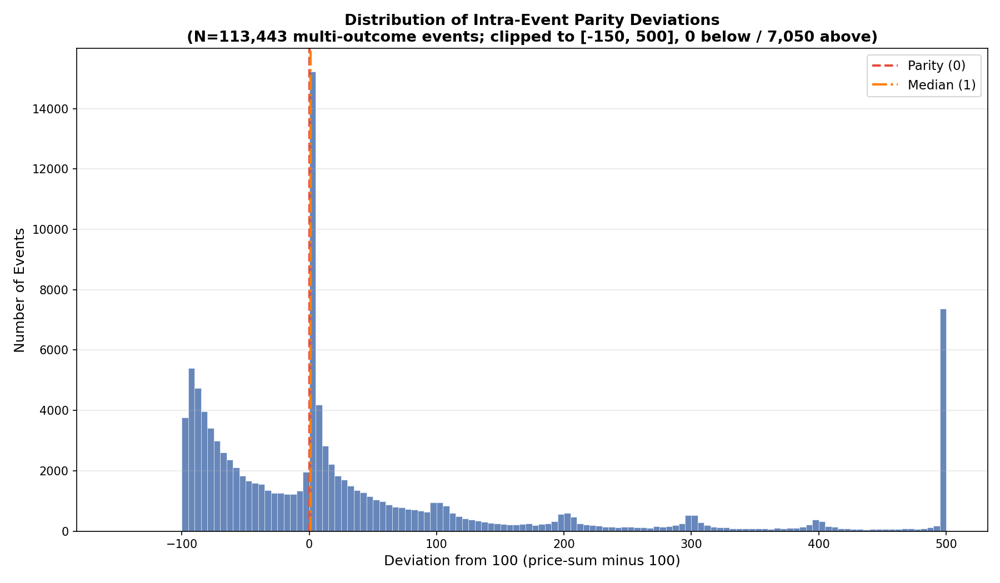
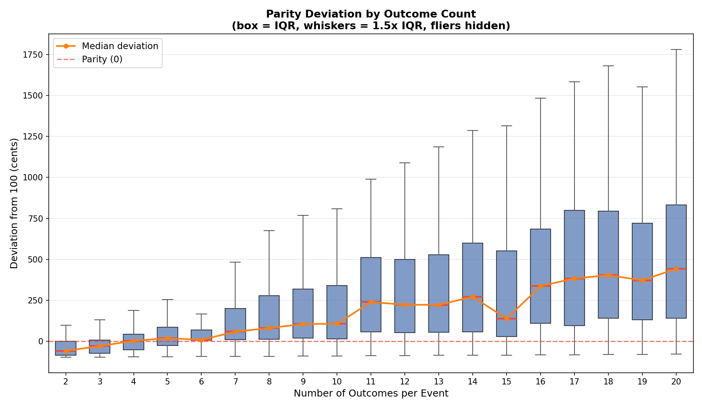

# §4.2: Intra-Event Parity

## Summary

Across 113,443 multi-outcome events on Kalshi, the median parity deviation is just +1 cent, but the mean is +96.5 cents -- revealing a heavily right-skewed distribution driven by high-outcome-count events with substantial overround. Two-outcome events are systematically *under*-priced (median deviation of -59 cents), while events with 6 or more outcomes consistently exceed the theoretical sum of 100, with the overround growing roughly linearly with the number of contracts. Over 84% of events show deviations exceeding 5 cents in absolute terms, indicating that perfect parity is the exception rather than the rule.

## Methodology

For each multi-outcome event (events with 2 or more contracts), we:

1. Grouped all markets sharing the same `event_ticker`.
2. Summed `last_price` (in cents, 0--100) across all contracts in the event.
3. Computed deviation as `SUM(last_price) - 100`.

For mutually exclusive and exhaustive outcomes, the fair-value sum of all contract prices should equal 100 cents. Positive deviations indicate **overround** (embedded vig), meaning a buyer paying last-price for every outcome would pay more than 100 cents total. Negative deviations suggest **underpricing**, potentially from illiquid contracts with stale or low last-prices.

We filtered to contracts with `last_price > 0` and non-null `event_ticker`, yielding 113,443 qualifying events. Results are stratified by the number of outcomes per event (2 through 20).

## Results

### Distribution of Parity Deviations

The distribution is bimodal and heavily skewed. A large cluster of events sits in the -100 to 0 range, dominated by 2- and 3-outcome events where one or both contracts have very low last-prices (e.g., one contract at 95 cents and the other at 1 cent gives a sum of 96, deviation = -4). A second mode sits near zero, and a long right tail extends past +500, representing high-outcome-count events with substantial overround.

Key statistics:
- **Median deviation:** +1.0 cents (close to parity)
- **Mean deviation:** +96.5 cents (pulled upward by the right tail)
- **Standard deviation:** 427.2 cents
- **IQR:** [-62, +72] cents
- **50.7%** of events have positive deviation (overround)
- **42.0%** have negative deviation (underpriced)

### Deviations by Outcome Count

The box plot reveals a clear structural relationship: deviation grows monotonically with the number of outcomes. This is expected -- each additional contract adds its own bid-ask spread and vig to the total. The relationship is approximately linear, with each additional outcome adding roughly 25--30 cents of overround on average.

| Outcomes | Count  | Mean Deviation | Median Deviation | % > 5pp |
|----------|--------|----------------|------------------|---------|
| 2        | 36,673 | -45.30         | -59.0            | 72.1%   |
| 3        | 16,212 | -24.07         | -30.0            | 84.1%   |
| 4        | 10,934 | +7.12          | +2.0             | 88.1%   |
| 5        | 8,615  | +40.24         | +18.0            | 90.5%   |
| 6        | 9,667  | +48.04         | +8.0             | 73.5%   |
| 7        | 4,973  | +106.66        | +58.0            | 95.7%   |
| 8        | 3,863  | +141.70        | +80.0            | 96.6%   |
| 9        | 3,596  | +183.54        | +105.0           | 97.8%   |
| 10       | 3,027  | +190.06        | +106.0           | 97.3%   |
| 11       | 3,168  | +316.88        | +239.0           | 98.9%   |
| 12       | 1,564  | +288.43        | +222.5           | 98.3%   |
| 13       | 1,206  | +304.09        | +222.0           | 97.7%   |
| 14       | 1,022  | +345.38        | +271.0           | 98.9%   |
| 15       | 1,337  | +310.05        | +137.0           | 97.2%   |
| 16       | 795    | +411.07        | +337.0           | 99.0%   |
| 17       | 831    | +499.61        | +383.0           | 98.8%   |
| 18       | 542    | +489.81        | +403.0           | 98.7%   |
| 19       | 416    | +463.97        | +371.5           | 99.3%   |
| 20       | 498    | +540.84        | +442.5           | 100.0%  |

Notable patterns:
- **2-outcome events** are heavily negatively deviated (median -59), likely because many binary events have one highly-favored outcome (e.g., 95c) and a low-priced counterpart (e.g., 2c), summing to only ~97.
- **4-outcome events** are the closest to parity (median +2.0), the crossover point between underpricing and overround.
- **6-outcome events** show a lower % > 5pp (73.5%) than neighboring groups, suggesting these events (often sports-related bracket markets) are more efficiently priced.
- Beyond 10 outcomes, median deviation exceeds 100 cents and climbs steadily, reflecting the compounding vig across many contracts.

## Key Findings

- **Parity violations are pervasive:** 84% of multi-outcome events deviate more than 5 cents from the theoretical sum of 100. Perfect parity is rare.
- **Overround scales with outcome count:** Each additional contract adds roughly 25--30 cents to the total price sum, representing per-contract vig. A 10-outcome event carries a median overround of 106 cents (a 106% overround on the theoretical 100-cent total).
- **Low-outcome events are underpriced, not overpriced:** 2- and 3-outcome events have *negative* deviations (medians of -59 and -30 respectively), driven by illiquid low-priced contracts and stale last-prices that understate true fair value.
- **The transition point is ~4 outcomes:** Events with 4 contracts are closest to theoretical parity, with a median deviation of just +2 cents.

## Strategy Implication

Intra-event parity violations present both **overround arbitrage** and **underpricing** opportunities:

1. **Selling overround in high-outcome events.** For events with 10+ outcomes and a price sum well above 100, selling (going "No") on every contract guarantees a profit if the total cost of the "No" portfolio is less than `(n - 1) * 100 - price_sum_yes`. The challenge is execution: simultaneously filling multiple limit orders.

2. **Buying underpriced low-outcome events.** For 2- and 3-outcome events with a price sum well below 100, buying "Yes" on all contracts guarantees a guaranteed winner at a discount. A sum of 90 cents means a guaranteed 10-cent profit per event (minus fees).

3. **Normalizing for expected overround.** Rather than comparing to a fixed benchmark of 100, a more refined strategy would model the expected overround as a function of outcome count and flag events that deviate from that *expected* overround -- these are the true mispricings.

4. **Filtering by volume.** The most actionable opportunities are in liquid events where last_price closely reflects executable prices. Illiquid markets may show large deviations that cannot actually be captured.

## Limitations

- **`last_price` is not executable.** The last traded price may be stale, especially for illiquid contracts. A deviation computed from last_price does not guarantee the same deviation exists at the current bid/ask. Using `yes_bid` / `yes_ask` would give a tighter, more actionable estimate.
- **Timing mismatch.** Contracts within an event may have been last traded at different times. The price sum aggregates prices that are not necessarily contemporaneous, inflating apparent deviations.
- **Not all events are mutually exclusive.** The parity condition (prices sum to 100) only holds for mutually exclusive, exhaustive outcome sets. Some Kalshi events may have overlapping or non-exhaustive outcome structures, making the 100-cent benchmark inappropriate.
- **Fees and execution costs are ignored.** Kalshi charges fees on trades, which would reduce or eliminate small arbitrage opportunities.
- **Snapshot data, not time-series.** This analysis uses a single snapshot of each market. Deviations may be transient and close quickly, or they may persist -- we cannot distinguish without time-series data.
