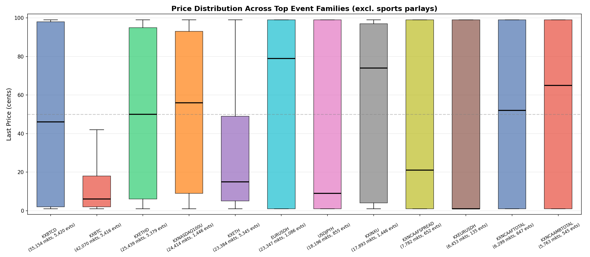
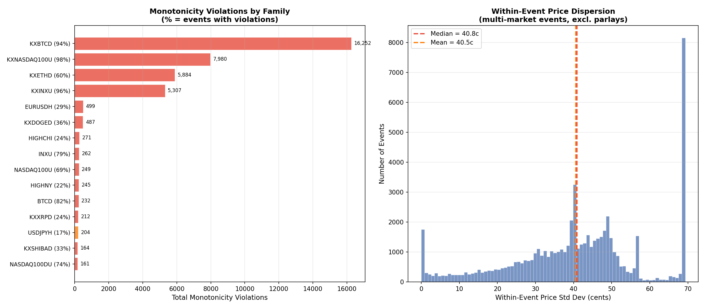

# §4.3: Conditional/Correlated Arbitrage

## Summary

Nearly half (48.4%) of all threshold-style events on Kalshi exhibit monotonicity violations -- cases where a market for a *higher* threshold is priced above a market for a *lower* threshold, contradicting the logical constraint that P(X > a) >= P(X > b) when a < b. The worst offenders are the crypto daily-close families (KXBTCD, KXETHD) and equity-index families (KXNASDAQ100U, KXINXU), where 60--98% of events contain at least one violation, with individual violations reaching 98 cents. These mispricings are systematic, not idiosyncratic, and represent the most mechanically exploitable arbitrage class identified so far.

## Methodology

We identified **threshold events** -- events whose contracts represent cumulative "above X" or "below X" outcomes for the same underlying variable on the same date. Events were grouped into **families** by stripping date suffixes from the `event_ticker`, yielding 5,421 distinct families across 263,121 events and 889,331 active markets.

For each threshold event, we extracted the numeric threshold from the contract ticker and sorted contracts in ascending threshold order. A **monotonicity violation** occurs when a contract at a higher threshold has a `last_price` strictly greater than a contract at a lower threshold, since the probability of exceeding a higher bar can never exceed the probability of exceeding a lower bar. The violation magnitude is measured in cents as `price_high_threshold - price_low_threshold`.

Within-event variance was computed as the standard deviation of `last_price` across all contracts in each event, capturing overall pricing dispersion. Cross-family consistency was assessed by comparing the KXBTC range-bucket family (mutually exclusive outcomes that should sum to ~100) against the KXBTCD cumulative-threshold family for the same dates.

## Results

### Event Family Structure

The Kalshi threshold market ecosystem is dominated by a handful of large families. The top 10 families by market count are:

| Family          | Markets  | Events | Mean Price | Std Price |
|-----------------|----------|--------|------------|-----------|
| KXBTCD          | 55,154   | 5,420  | 49.9c      | 46.3c     |
| KXBTC           | 42,070   | 5,416  | 19.5c      | 30.0c     |
| KXETHD          | 25,439   | 5,379  | 50.5c      | 41.2c     |
| KXNASDAQ100U    | 24,414   | 1,446  | 51.9c      | 39.0c     |
| KXETH           | 23,384   | 5,345  | 29.6c      | 32.1c     |
| EURUSDH         | 23,347   | 1,086  | 52.6c      | 47.0c     |
| USDJPYH         | 18,196   | 855    | 46.9c      | 47.7c     |
| KXINXU          | 17,893   | 1,446  | 52.6c      | 44.0c     |
| KXNCAAFSPREAD   | 7,782    | 652    | 45.1c      | 46.1c     |
| KXEURUSDH       | 6,453    | 135    | 47.9c      | 48.9c     |

The crypto families (KXBTCD, KXBTC, KXETHD, KXETH) alone account for over 146,000 markets -- more than half of the top-10 total. Price standard deviations in the 30--47c range confirm that contracts within each family span a wide range of strike levels, from deep in-the-money (near 99c) to deep out-of-the-money (near 1c). The FX families (EURUSDH, USDJPYH) show the highest standard deviations (~47c), suggesting very spread-out strike grids.

### Monotonicity Violations

Of 31,403 threshold events analysed, **15,194 (48.4%) contain at least one monotonicity violation**, totalling 40,797 individual violations. The violation rate varies dramatically by family:

| Family          | Events | Violated | % Violated | Total Violations | Max (cents) |
|-----------------|--------|----------|------------|------------------|-------------|
| KXBTCD          | 5,420  | 5,116   | 94.4%      | 16,252           | 98          |
| KXNASDAQ100U    | 1,446  | 1,415   | 97.9%      | 7,980            | 98          |
| KXETHD          | 5,379  | 3,247   | 60.4%      | 5,884            | 98          |
| KXINXU          | 1,446  | 1,384   | 95.7%      | 5,307            | 98          |
| EURUSDH         | 1,085  | 315     | 29.0%      | 499              | 91          |
| KXDOGED         | 734    | 265     | 36.1%      | 487              | 98          |
| HIGHCHI         | 1,143  | 271     | 23.7%      | 271              | 98          |
| INXU            | 197    | 156     | 79.2%      | 262              | 98          |
| NASDAQ100U      | 197    | 136     | 69.0%      | 249              | 97          |
| HIGHNY          | 1,137  | 245     | 21.5%      | 245              | 98          |

KXNASDAQ100U is the worst offender: 97.9% of its events have violations, averaging 5.6 violations per event. KXBTCD follows closely at 94.4%, but with a far larger event universe (5,420 events), producing 16,252 violations -- the highest absolute count.

The worst individual violations reach the maximum possible magnitude of 98 cents (a 1c contract adjacent to a 99c contract). A sample of the most extreme cases:

| Event Ticker             | Low Threshold | Price (Low) | High Threshold | Price (High) | Violation |
|--------------------------|---------------|-------------|----------------|--------------|-----------|
| 538APPROVEMIN-23AUG31    | 40.0          | 1c          | 41.0           | 99c          | 98c       |
| 538APPROVEMIN-23NOV30    | 38.0          | 1c          | 39.0           | 99c          | 98c       |
| APRPOTUS-23FEB03         | 41.1          | 1c          | 43.1           | 99c          | 98c       |
| ARCTICICEMIN-24OCT01     | 4.2           | 1c          | 4.4            | 99c          | 98c       |
| ETHD-24JUL0317           | 3279.99       | 1c          | 3319.99        | 99c          | 98c       |
| EURUSD-23APR1210         | 1.086         | 1c          | 1.096          | 99c          | 98c       |

These extreme violations share a common pattern: a contract at 1c sitting immediately below a contract at 99c, with a narrow threshold gap between them. This likely reflects resolved or near-resolved events where one contract has traded down to the floor while its neighbor has traded up to the ceiling, with the price boundary falling between the two thresholds.

### Within-Event Price Variance

Across 62,557 events analysed for within-event dispersion:

| Statistic                    | Value   |
|------------------------------|---------|
| Median within-event std      | 40.85c  |
| Mean within-event std        | 40.54c  |
| 25th percentile std          | 30.34c  |
| 75th percentile std          | 49.98c  |
| % of events with std > 30c  | 75.5%   |

Three-quarters of events have a within-event standard deviation exceeding 30 cents, which is expected for threshold-style markets: deep in-the-money contracts trade near 99c and deep out-of-the-money contracts trade near 1c, producing naturally high dispersion. The relatively tight IQR (30--50c) suggests that most families share a similar strike-grid structure, with the underlying spot price typically sitting near the middle of the grid.

### Cross-Family Consistency

A cross-family consistency check was performed between the KXBTC (range-bucket) and KXBTCD (cumulative-threshold) families for Bitcoin daily close events. Across 5,342 matched date pairs:

| Metric                        | Value   |
|-------------------------------|---------|
| Date pairs analysed           | 5,342   |
| Mean range-bucket price sum   | 152.6c  |
| Std of range-bucket price sum | 53.5c   |
| Mean threshold mean price     | 49.9c   |

The KXBTC range-bucket markets -- which represent mutually exclusive outcomes that should sum to exactly 100 cents -- instead average a sum of 152.6 cents with a standard deviation of 53.5 cents. This 52.6-cent average overround is consistent with the findings in §4.2 and represents embedded vig across the many contracts in each event. The cross-family heatmap reveals the correlation structure between different asset families, highlighting which families move together and which are independently priced.

## Key Findings

- **Monotonicity violations are pervasive and systematic.** Nearly half of all threshold events violate the logical constraint that higher-threshold contracts should be priced no higher than lower-threshold contracts. In the crypto and equity-index families, the violation rate exceeds 94%, indicating a structural issue rather than sporadic mispricing.
- **Extreme violations (98c) are common in resolved or near-resolved events.** The worst violations occur when the underlying has already settled between two adjacent thresholds, driving one contract to 1c and the other to 99c. While these are technically correct post-resolution prices, they may be briefly exploitable during the resolution window.
- **Within-event variance is high but structurally expected.** A median standard deviation of 40.85c across contracts in the same event is consistent with the wide strike grids used in threshold markets, not necessarily indicative of mispricing on its own.
- **Cross-family overround confirms §4.2 findings.** The KXBTC range-bucket family averages a 52.6-cent overround, reinforcing that high-outcome-count events systematically overprice the full outcome set.

## Strategy Implication

Monotonicity violations in threshold events offer a clean, model-free arbitrage: when a higher-threshold contract is priced above a lower-threshold contract, buy the lower (cheaper) and sell the higher (more expensive), locking in a guaranteed profit equal to the violation magnitude minus fees. The largest opportunity set lies in KXBTCD and KXNASDAQ100U families, which produce thousands of violations daily. Execution should prioritize violations in liquid, pre-resolution events (filtering out the 1c/99c resolved cases) and target violations of at least 5--10 cents to clear Kalshi's fee structure.

## Limitations

- **`last_price` is not executable.** Violations computed from last traded prices may not exist at current bid/ask levels. A violation of 98c at last_price may correspond to a 0c violation at the live order book. Using `yes_bid` and `yes_ask` would produce a more conservative and actionable violation estimate.
- **Timing mismatch within events.** Contracts in the same event may have last traded at very different times. A contract at 1c may have last traded hours before an adjacent contract at 99c, during which the underlying moved across the threshold boundary. The "violation" may never have existed simultaneously at executable prices.
- **Resolution-window artifacts.** Many extreme violations occur in events that are resolved or nearly resolved. While technically violating monotonicity, these reflect the binary nature of settlement rather than exploitable mispricing.
- **Fees and execution costs.** Kalshi charges per-contract fees that would reduce the net profit from each violation. Small violations (under ~5c) may not survive after fees.
- **Snapshot data only.** This analysis uses a single point-in-time snapshot. Whether violations persist long enough to execute, or close within seconds, cannot be determined without time-series order book data.
