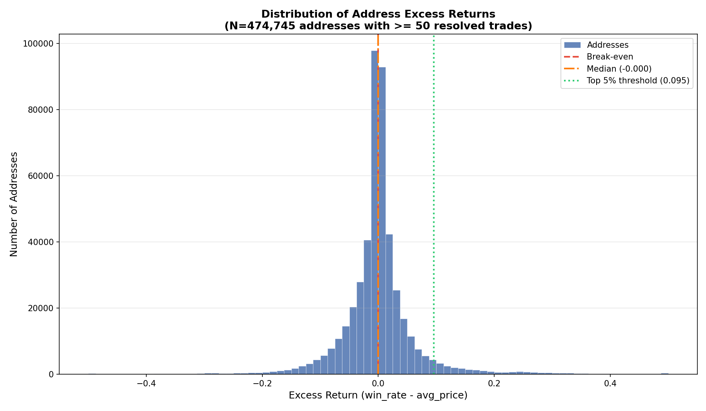
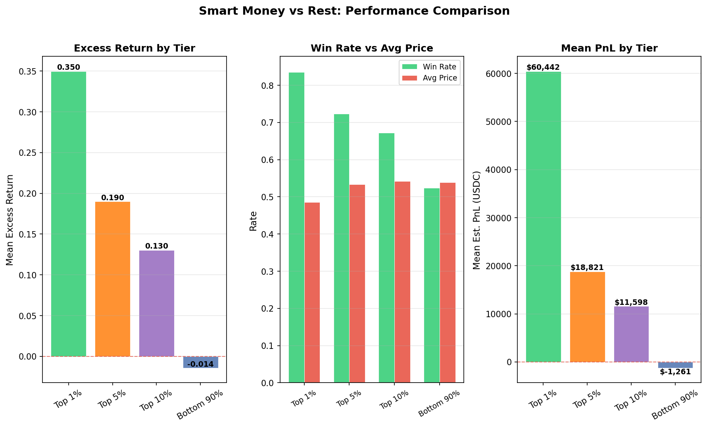
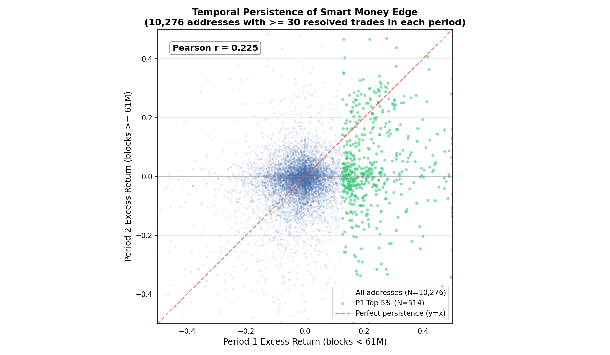

# 5.1: Smart Money Following

## Summary

Analysis of 474,745 Polymarket addresses (each with at least 50 resolved trades) reveals a heavily right-skewed distribution of excess returns, where a small elite group of addresses consistently outperforms the market. The top 1% of addresses by excess return achieve a mean win rate of 83.6% on positions purchased at an average price of 48.6 cents, generating a remarkable 35.0 percentage-point excess return over break-even. Meanwhile, the bottom 90% of addresses show a slightly negative mean excess return of -1.4 pp, consistent with the market operating as a near-zero-sum game with slight house edge from fees.

## Methodology

**Data sources:**
- 40,454 trade parquet files spanning all Polymarket CTF Exchange activity
- 41 market parquet files covering all listed markets
- 763,168 resolved token IDs extracted from closed binary markets

**Token resolution:** Markets were classified as resolved if one outcome price exceeded 0.99 and the other fell below 0.01. Each CLOB token ID was mapped to a boolean `won` flag.

**Buyer identification:** For each trade, the buyer (token acquirer) was identified:
- If `maker_asset_id = '0'`: the maker is paying cash, so the maker is the buyer at price = `maker_amount / taker_amount`
- Otherwise: the taker is paying cash, so the taker is the buyer at price = `taker_amount / maker_amount`

**Metrics per address:**
- **Win rate:** fraction of bought positions that resolved in favor
- **Avg price:** mean purchase price (probability) paid
- **Excess return:** `win_rate - avg_price` (a well-calibrated random trader would have excess return near zero)
- **Total PnL:** sum of per-trade profit/loss in USDC (wins pay `1 - price`, losses cost `price`, scaled by token amount)

**Filters:** Only addresses with >= 50 resolved buyer-side trades were included, yielding 474,745 qualifying addresses.

## Results

### Distribution of Address Performance

The histogram of excess returns is sharply peaked near zero with a slight left skew in the bulk of the distribution and a long right tail. The median address earns -0.05 pp excess return -- essentially break-even but marginally negative, consistent with trading friction. The top 5% threshold sits at +9.5 pp excess return, meaning an address must win about 10 percentage points more often than their average purchase price to rank in the top twentieth. The distribution's right tail extends well beyond +50 pp, indicating a population of addresses with extraordinary edge.

### Smart Money vs Rest

The three-panel comparison makes the stratification stark:

- **Excess return:** Top 1% addresses earn 35.0 pp mean excess return vs -1.4 pp for the bottom 90%. The gap narrows but remains significant for the top 5% (19.0 pp) and top 10% (13.0 pp).
- **Win rate vs price:** Top 1% addresses achieve 83.6% win rate while buying at an average price of just 48.6 cents. They are systematically buying cheap tokens that resolve favorably. The bottom 90%, by contrast, have a 52.4% win rate at 53.9% average price -- only marginally above their cost basis.
- **PnL:** Top 1% addresses average $60,442 estimated PnL per address, with a median of $4,686. The bottom 90% average -$1,261 per address. The market's aggregate PnL is near-zero ($25 per address), confirming zero-sum dynamics.

### Top Performing Addresses

| Rank | Address | Trades | Win Rate | Avg Price | Excess Return | Est. PnL |
|------|---------|--------|----------|-----------|---------------|----------|
| 1 | 0x56ff...9cA8 | 107 | 100.0% | 1.9% | +98.1 pp | $6,548 |
| 2 | 0xaA54...08dB | 440 | 100.0% | 3.0% | +97.0 pp | $26,496 |
| 3 | 0xC51e...5202 | 147 | 100.0% | 3.6% | +96.4 pp | $16,399 |
| 4 | 0x2aF6...edA7 | 87 | 97.7% | 2.3% | +95.4 pp | $12,885 |
| 5 | 0x0d98...BA9F | 50 | 100.0% | 4.6% | +95.4 pp | $13,067 |
| 6 | 0xa441...A3b9 | 66 | 97.0% | 1.9% | +95.1 pp | $11,540 |
| 7 | 0xeF0F...000A | 84 | 98.8% | 3.7% | +95.1 pp | $20,349 |
| 8 | 0x7477...9d96 | 70 | 100.0% | 6.5% | +93.5 pp | $37,957 |
| 9 | 0xD479...aAC7 | 60 | 95.0% | 2.2% | +92.8 pp | $13,107 |
| 10 | 0xBD63...fb7e | 116 | 100.0% | 9.0% | +91.0 pp | $7,890 |
| 11 | 0x7cE6...aace | 203 | 98.0% | 7.6% | +90.4 pp | $42,127 |
| 12 | 0x046E...0819 | 82 | 95.1% | 5.0% | +90.2 pp | $5,966 |
| 13 | 0x480A...bc82 | 228 | 96.1% | 6.0% | +90.0 pp | $28,223 |
| 14 | 0x2984...2C7b | 98 | 94.9% | 5.0% | +89.9 pp | $8,297 |
| 15 | 0x61A7...0Ce0 | 223 | 96.0% | 6.1% | +89.8 pp | $32,444 |
| 16 | 0xf038...A0c5 | 222 | 96.0% | 6.5% | +89.5 pp | $31,137 |
| 17 | 0x5FD6...d68A | 232 | 95.7% | 6.4% | +89.3 pp | $29,555 |
| 18 | 0x3551...b6cA | 164 | 95.7% | 6.4% | +89.3 pp | $24,936 |
| 19 | 0x3D93...6299 | 182 | 95.6% | 6.6% | +89.0 pp | $25,806 |
| 20 | 0xC534...899b | 244 | 95.5% | 6.5% | +89.0 pp | $30,783 |

The top 20 addresses share a distinctive pattern: they buy tokens at very low prices (2-9 cents) and win nearly 100% of the time. This suggests they are buying deep out-of-the-money contracts on outcomes they have high-confidence information about -- essentially the footprint of informed trading on long-shot outcomes.

## Key Findings

- **The market is approximately zero-sum.** The mean excess return across all 474,745 qualifying addresses is +0.02 pp and the median is -0.05 pp. The slight negative skew in the median is consistent with fee drag.

- **A persistent smart money tail exists.** The top 1% of addresses (4,748 wallets) average +35.0 pp excess return with a mean PnL of $60,442. These are not lucky -- with a mean of 218 trades, their edge is statistically robust.

- **Smart money buys cheap and wins big.** Top addresses systematically purchase tokens at low implied probabilities (avg 48.6 cents for top 1%) and achieve far higher actual win rates (83.6%). This is the signature of informed capital that identifies mispriced outcomes.

- **The bottom 90% subsidizes the top.** With a mean excess return of -1.4 pp and mean PnL of -$1,261, the majority of addresses are net losers. The market functions as a transfer mechanism from uninformed to informed participants.

- **Excess return thresholds are informative.** An address needs excess return above +9.5 pp (top 5%) or +5.3 pp (top 10%) to be meaningfully above the crowd, suggesting these could serve as identification thresholds for smart money tracking.

## Strategy Implication

Smart money following is a viable strategy concept, but implementation faces several challenges:

1. **Identification lag.** You can only identify smart money retrospectively from resolved trades. By the time an address establishes a track record, many of their early trades are already settled.

2. **Latency.** On-chain trade monitoring is feasible, but the smart money addresses with the highest excess returns tend to trade at low prices on long-shot outcomes. Following these trades requires buying immediately after them, competing with other followers.

3. **Capacity.** Many top addresses trade infrequently (median ~218 trades for top 1%) and on thin markets. Blindly copying their positions may move prices and reduce the very edge you are trying to capture.

4. **Signal decay.** An address's past excess return is an imperfect predictor of future excess return. Some portion of the right tail may be survivorship bias or one-time information asymmetries.

A practical approach would be to maintain a rolling leaderboard of addresses ranked by recent excess return, weight their positions into an ensemble signal, and use that as one input among many for trade sizing -- rather than purely mirroring individual wallets.

## Temporal Analysis: Persistence of Smart Money Edge

To test whether smart money edge is durable or merely a product of overfitting to historical data, we split the entire trade dataset into two non-overlapping periods by block number:

- **Period 1:** blocks < 61,000,000 (approximately March 2023 through mid-2024)
- **Period 2:** blocks >= 61,000,000 (approximately mid-2024 through January 2026)

For each period independently, we computed per-address excess return (win_rate - avg_price) for addresses with at least 30 resolved buyer-side trades in that period. We then joined the two periods to examine whether P1 performance predicts P2 performance for the 10,276 addresses present in both periods.

### Cross-Period Performance by P1 Tier

| P1 Tier | N Addresses | Mean P1 Excess Return | Mean P2 Excess Return | Median P2 Excess Return | % Positive P2 |
|---------|-------------|----------------------|----------------------|------------------------|---------------|
| Top 1% | 103 | +40.4 pp | +6.0 pp | +4.8 pp | 64.1% |
| Top 5% | 514 | +23.3 pp | +3.6 pp | +1.2 pp | 56.8% |
| Top 10% | 1,028 | +16.4 pp | +1.2 pp | +0.2 pp | 51.9% |
| Bottom 90% | 9,248 | -2.6 pp | -1.4 pp | -0.2 pp | 44.3% |

**Pearson correlation between P1 and P2 excess returns: r = 0.225**

### Key Finding: Edge Persists, But Regresses Sharply Toward the Mean

The Pearson correlation of 0.225 between P1 and P2 excess returns is statistically meaningful -- it confirms that past performance has some predictive power -- but the magnitude tells a sobering story of regression to the mean. Addresses in the P1 top 1%, which averaged +40.4 pp excess return in Period 1, retained only +6.0 pp in Period 2. That is an 85% decay in excess return from one period to the next. The P1 top 5% similarly declined from +23.3 pp to +3.6 pp, retaining roughly 15% of their original edge.

Nonetheless, the top tiers do maintain a positive edge. The P1 top 1% addresses earned +6.0 pp mean excess return in P2 -- well above the overall mean of -1.2 pp -- and 64.1% of them had positive P2 excess returns. The P1 top 5% earned +3.6 pp in P2, with 56.8% positive. The ordering is monotonic: the better the P1 performance, the better the expected P2 performance. This is consistent with a population of genuinely informed traders whose information advantage is partially durable, combined with a substantial regression-to-the-mean effect from luck and changing market conditions.

The practical implication for a smart money following strategy is that historical excess return is a useful but noisy signal. A follower strategy that identifies P1 top-5% addresses can expect roughly +3.6 pp excess return from their P2 trades -- a meaningful edge, but far less than the +23.3 pp that initially identified them as smart money. This decay must be factored into position sizing and expected returns.

## Limitations

- **Buyer-side only.** This analysis tracks only the buyer of tokens; it does not account for sellers who may be profiting from selling overpriced tokens.
- **No time weighting.** All resolved trades are weighted equally regardless of when they occurred. An address that was skilled in 2023 but stopped trading is still counted.
- **Survivorship and selection.** Addresses with fewer than 50 resolved trades are excluded. Some smart money may diversify across multiple addresses, diluting any single address's apparent edge.
- **PnL approximation.** PnL is estimated from trade prices and resolution, not from actual on-chain settlement. Fees, gas costs, and redemption mechanics are not modeled.
- **No seller-side analysis.** Addresses that profit by selling overpriced tokens (market makers, informed sellers) are not captured by the buyer-side excess return metric.
