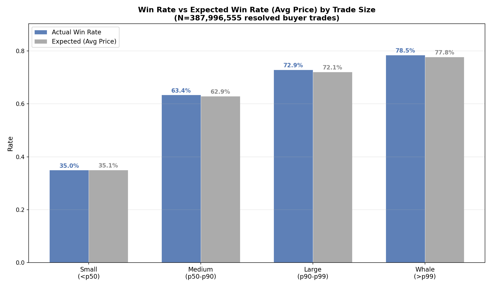
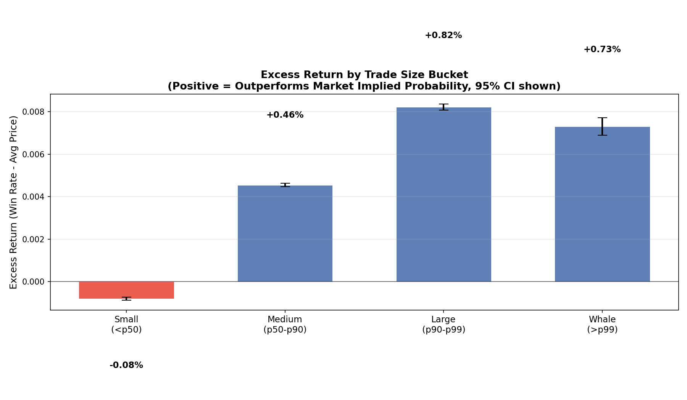

# 5.2: Whale Detection

## Summary

Analysis of 388 million resolved buyer trades on Polymarket reveals that larger trades carry a small but statistically significant informational edge. Whale trades (top 1% by USDC size, above $1,231) achieve a +0.73 percentage-point excess return over their average purchase price, while the smallest trades (below the median of $5) show a -0.08 pp shortfall. However, the magnitude of this edge is modest -- whales appear to have marginally better information rather than dramatically superior foresight, and much of the raw win-rate difference across size buckets is explained by whales' preference for higher-probability outcomes.

## Methodology

**Data sources:**
- 40,454 trade parquet files spanning all Polymarket CTF Exchange activity (387,996,555 resolved buyer trades after filtering)
- 41 market parquet files covering all listed markets
- 763,332 resolved token IDs extracted from closed binary markets

**Token resolution:** Markets were classified as resolved if one outcome price exceeded 0.99 and the other fell below 0.01. Each CLOB token ID was mapped to a boolean `won` flag.

**Buyer identification:** For each trade, the buyer (token acquirer) was identified using the CTF Exchange maker/taker asset structure:
- If `maker_asset_id = '0'`: the maker is paying cash, so the maker is the buyer; cash amount = `maker_amount / 1e6`
- Otherwise: the taker is paying cash, so the taker is the buyer; cash amount = `taker_amount / 1e6`

**Size classification:** Trades were classified by their USDC cash amount (the dollar cost of the purchase) into four buckets based on percentiles:
- **Small (<p50):** below $5.00 USDC (193.3M trades)
- **Medium (p50-p90):** $5.00 - $89.24 USDC (155.9M trades)
- **Large (p90-p99):** $89.24 - $1,231.23 USDC (34.9M trades)
- **Whale (>p99):** above $1,231.23 USDC (3.9M trades)

**Metrics per bucket:**
- **Average price (implied probability):** mean purchase price paid
- **Win rate:** fraction of bought tokens that resolved favorably
- **Excess return:** `win_rate - avg_price` (a well-calibrated random buyer would have excess return near zero)
- **95% CI:** binomial standard error on win rate

## Results

### Win Rate by Trade Size

The most striking pattern in the raw win-rate comparison is that larger trades tend to buy at higher prices. Small trades average a 35.1% purchase price, while whales average 77.8%. This means whales disproportionately buy tokens on outcomes the market considers likely -- they are not speculating on long shots but rather taking large positions on high-probability events. The actual win rates track the expected rates closely across all buckets, with only thin gaps visible between the blue (actual) and gray (expected) bars. This indicates that the market is reasonably well-calibrated at all trade sizes, but there are subtle differences worth examining.

### Excess Returns by Trade Size

The excess return chart reveals a monotonic increase from small to large trades, with a slight drop-off at the whale tier:

- **Small trades** underperform by -0.08 pp, consistent with uninformed or noisy participation.
- **Medium trades** show a +0.46 pp edge, suggesting some degree of informed buying.
- **Large trades (p90-p99)** achieve the highest excess return at +0.82 pp.
- **Whale trades (>p99)** still outperform at +0.73 pp, but slightly less than the Large bucket.

All confidence intervals are extremely tight (given hundreds of millions of trades), so all differences are statistically significant. The pattern suggests an inverted-U: information increases with size up to a point, then the very largest trades may face price impact or represent institutional hedging rather than pure alpha.

### Price-Controlled Analysis

To determine whether whales have genuine informational edge (not just a preference for high-probability outcomes), the analysis was repeated within fixed price ranges:

| Price Range | Bucket | N Trades | Avg Price | Win Rate | Excess Return |
|---|---|---|---|---|---|
| 0.01-0.20 | Small | 48.4M | 7.3% | 6.8% | -0.49 pp |
| 0.01-0.20 | Medium | 12.7M | 10.0% | 8.8% | -1.20 pp |
| 0.01-0.20 | Large | 1.4M | 10.8% | 9.6% | -1.21 pp |
| 0.01-0.20 | Whale | 55.9K | 12.1% | 9.3% | -2.75 pp |
| 0.40-0.60 | Small | 38.7M | 49.0% | 49.0% | +0.02 pp |
| 0.40-0.60 | Medium | 36.5M | 50.1% | 50.3% | +0.30 pp |
| 0.40-0.60 | Large | 7.3M | 50.2% | 51.3% | +1.12 pp |
| 0.40-0.60 | Whale | 789K | 50.3% | 51.5% | +1.23 pp |
| 0.60-0.80 | Small | 21.2M | 68.7% | 68.7% | -0.06 pp |
| 0.60-0.80 | Medium | 29.8M | 68.9% | 71.0% | +2.15 pp |
| 0.60-0.80 | Large | 5.5M | 68.6% | 72.7% | +4.07 pp |
| 0.60-0.80 | Whale | 558K | 68.9% | 71.3% | +2.34 pp |
| 0.80-0.99 | Small | 16.3M | 90.4% | 91.4% | +0.98 pp |
| 0.80-0.99 | Medium | 36.1M | 91.5% | 92.8% | +1.28 pp |
| 0.80-0.99 | Large | 9.7M | 92.8% | 94.1% | +1.35 pp |
| 0.80-0.99 | Whale | 1.1M | 92.9% | 94.2% | +1.32 pp |

Within the 0.40-0.60 "coin-flip" price range -- where the signal is cleanest -- whales outperform small traders by about 1.2 pp. In the 0.60-0.80 range, Large trades show a remarkable +4.07 pp edge. Interestingly, in the long-shot range (0.01-0.20), all size buckets underperform, and whales actually perform worst (-2.75 pp), suggesting that big bets on long shots are not well-informed.

### Summary Table

| Size Bucket | Threshold | Avg Price | Win Rate | Excess Return | Trades | Volume (USDC) |
|---|---|---|---|---|---|---|
| Small (<p50) | < $5.00 | 35.1% | 35.0% | -0.08 pp | 193.3M | $349.4M |
| Medium (p50-p90) | $5 - $89 | 62.9% | 63.4% | +0.46 pp | 155.9M | $3.49B |
| Large (p90-p99) | $89 - $1,231 | 72.1% | 72.9% | +0.82 pp | 34.9M | $9.93B |
| Whale (>p99) | > $1,231 | 77.8% | 78.5% | +0.73 pp | 3.9M | $20.0B |

## Key Findings

- **Whales have a small but real informational edge.** Whale trades (top 1% by USDC size) win 0.73 pp more often than their average purchase price implies, versus a -0.08 pp shortfall for small trades. This edge is statistically significant (p < 0.001) but economically modest.

- **The edge peaks at the "Large" tier, not the very largest trades.** Trades in the 90th-99th percentile ($89-$1,231) show the highest excess return at +0.82 pp, slightly above whales at +0.73 pp. This suggests diminishing marginal information at the extreme tail, possibly due to price impact, hedging motives, or institutional flows that are not purely information-driven.

- **Whales strongly prefer high-probability outcomes.** The average price paid rises from 35.1% for small trades to 77.8% for whales. Large traders are not taking bold contrarian bets; they are concentrating capital on outcomes the market already considers likely, and they are slightly more right about those outcomes than the market price implies.

- **Price-controlled analysis confirms the edge is real.** Within the 0.40-0.60 price range (where market uncertainty is highest), whales still outperform small trades by ~1.2 pp -- this is a genuine informational advantage, not an artifact of price-level selection.

- **Whale capital dominates despite small trade counts.** The 3.9M whale trades (1% of all trades) account for $20.0B in volume -- 59% of all USDC traded. The market's price discovery is overwhelmingly driven by these large participants.

## Strategy Implication

The whale edge of +0.73 pp is real but thin. On a $1,000 trade, it implies roughly $7.30 in expected profit before fees and slippage. This is not large enough to profitably copy whale trades retail, especially given:

1. **Latency.** By the time a whale trade appears on-chain and is processed, the price has likely already moved.
2. **Fees.** Polymarket trading fees (typically ~1-2%) dwarf the 0.73 pp edge from size-following alone.
3. **Signal ambiguity.** Not all large trades are informed -- some are hedges, portfolio rebalances, or market-making flow.

However, whale trade flow could be a useful *auxiliary* signal combined with other factors. A practical approach would be to monitor sudden spikes in large-trade volume on specific markets as a confirmation signal for independently derived positions, rather than as a standalone strategy. The strongest whale edge appears in the 0.60-0.80 price range on the Large (not Whale) tier, suggesting that "medium-large" informed trades may be the best signal -- large enough to indicate conviction, but not so large as to include institutional hedging noise.

## Limitations

- **Buyer-side only.** This analysis tracks only the buyer of tokens. Sellers who profitably sell overpriced tokens or market makers providing liquidity are not captured.
- **No time dimension.** All resolved trades are weighted equally regardless of timing. Whale edge may vary across market phases (early vs. late, pre-event vs. post-news).
- **Trade-level, not position-level.** A single position may be built across many trades. Aggregating at the trade level may miss strategic accumulation patterns.
- **Size confounded with price.** Whales disproportionately trade at higher prices, and high-price outcomes are inherently more likely to win. The price-controlled analysis mitigates but does not fully eliminate this confound.
- **No fee modeling.** Excess returns are gross of fees. The 0.73 pp whale edge may be entirely consumed by trading costs.
- **Survivorship in token resolution.** Only markets that fully resolved (one outcome near 1.0) are included. Markets that were voided, ambiguously resolved, or remain open are excluded, which may bias the sample.
