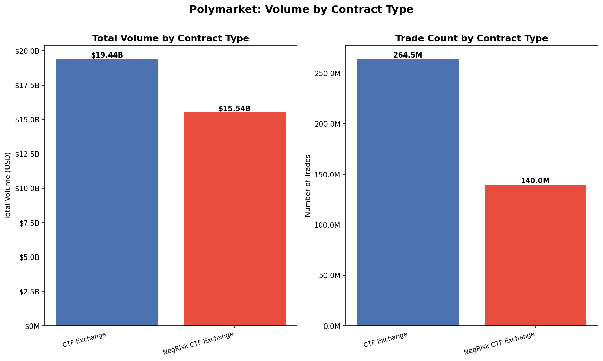
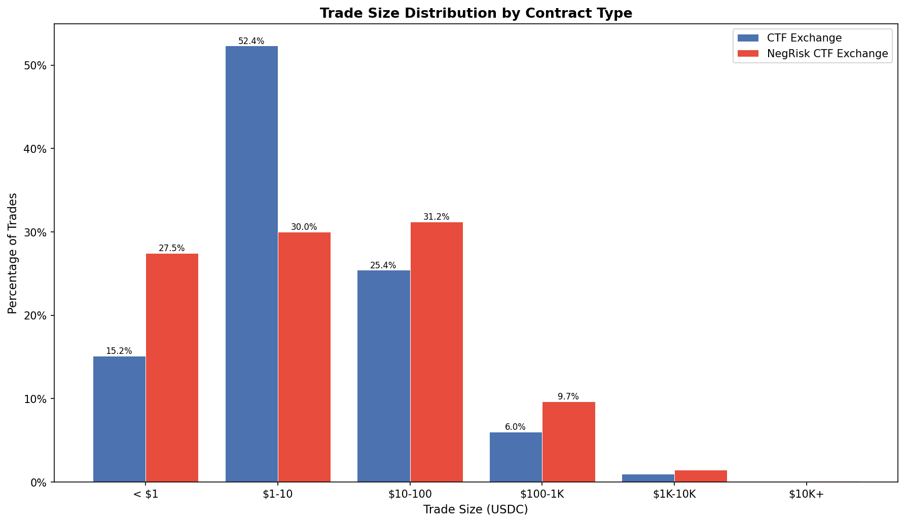
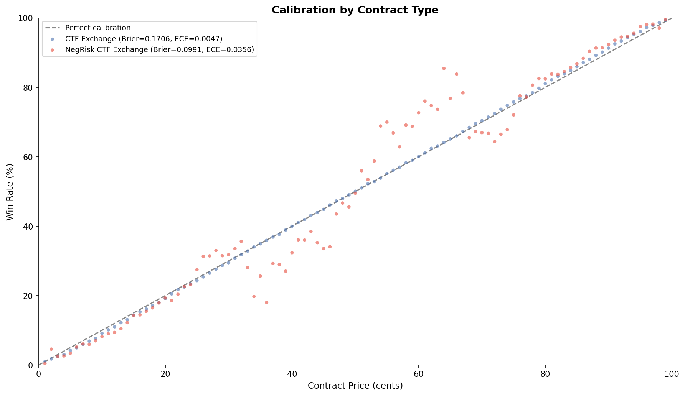

# 5.4: Contract Type Segmentation

## Summary

Polymarket operates two on-chain contract types: **CTF Exchange** (standard binary outcome tokens) and **NegRisk CTF Exchange** (multi-outcome markets using the NegRisk framework). CTF Exchange handles nearly twice the trade count (264.5M vs 140.0M trades) and slightly more total volume ($19.4B vs $15.5B), but NegRisk trades are 51% larger on average ($111 vs $73 median). The two contract types also diverge significantly in calibration: CTF Exchange shows near-perfect calibration (ECE = 0.005) while NegRisk markets deviate more at the tails (ECE = 0.036), though NegRisk's lower Brier score (0.099 vs 0.171) reflects heavier trading concentration at extreme prices.

## Methodology

**Data:** 404.5 million trades across 40,454 parquet files and 41 market metadata files from Polymarket's CTF Exchange and NegRisk CTF Exchange contracts.

**Contract type identification:** Each trade record contains a `_contract` field identifying whether it was executed on the standard CTF Exchange or the NegRisk CTF Exchange. No other contract types are present in the dataset.

**Volume computation:** Cash volume is extracted from each trade using the `maker_amount` when `maker_asset_id = '0'` (maker is paying cash) and `taker_amount` otherwise. Amounts are denominated in USDC with 6 decimal places (i.e., divided by 1e6 to get dollar values).

**Calibration:** For resolved markets, each trade's implied price is computed as `maker_amount / taker_amount` (when maker pays cash). The trade is matched to its token's resolution outcome. Win rate is computed per price-cent bucket and compared against the implied probability. Brier score, log loss, and ECE (Expected Calibration Error) are computed across all resolved trades within each contract type.

## Results

### Volume by Contract Type

| Metric | CTF Exchange | NegRisk CTF Exchange |
|--------|-------------|---------------------|
| Trade count | 264.5M | 140.0M |
| Total volume (USDC) | $19.44B | $15.54B |
| Average trade size | $73.48 | $110.99 |
| Median trade size | $4.89 | $6.17 |
| Distinct tokens | 432,393 | 158,790 |

CTF Exchange accounts for 65.4% of all trades but only 55.6% of total volume, reflecting its smaller average trade size. NegRisk CTF Exchange, despite fewer trades, carries 44.4% of total volume because its trades are 51% larger on average. The NegRisk exchange trades far fewer distinct tokens (158K vs 432K), consistent with its use for multi-outcome markets where a single question spawns many linked outcomes (e.g., "Who will win the 2024 election?" generates one NegRisk market with many outcome tokens, versus independent binary markets on CTF Exchange).

### Trade Size Distribution

| Size Bucket | CTF Exchange | NegRisk CTF Exchange |
|-------------|-------------|---------------------|
| < $1 | 15.2% | 27.5% |
| $1 - $10 | 52.4% | 30.0% |
| $10 - $100 | 25.4% | 31.2% |
| $100 - $1K | 6.0% | 9.7% |
| $1K - $10K | 1.0% | 1.5% |
| $10K+ | 0.07% | 0.10% |

The distributions reveal a striking structural difference. CTF Exchange is dominated by small trades: 67.5% of trades are under $10, with a sharp peak at $1-$10. NegRisk has a flatter distribution with more weight in the $10-$100 and $100-$1K buckets. However, NegRisk also has a disproportionately large sub-$1 bucket (27.5% vs 15.2%), likely reflecting the large number of low-probability multi-outcome tokens that trade at very low prices (e.g., long-shot candidates in a political race at 1-2 cents each).

### Calibration by Contract Type

| Metric | CTF Exchange | NegRisk CTF Exchange |
|--------|-------------|---------------------|
| Brier score | 0.1706 | 0.0991 |
| Log loss | 0.5043 | 0.3156 |
| ECE | 0.0047 | 0.0356 |
| Resolved trades | 250.3M | 94.3M |

The calibration chart reveals two very different patterns:

**CTF Exchange** hugs the perfect-calibration line with remarkable precision (ECE = 0.005). At every price level from 1 to 99 cents, the actual win rate closely matches the implied probability. Its higher Brier score (0.171) is consistent with the theoretical expected value for a well-calibrated market with trades distributed across all price levels (~0.17), rather than indicating poor calibration.

**NegRisk CTF Exchange** shows more scatter, particularly in the 30-80 cent range where win rates can deviate 5-15 percentage points from the diagonal. Its lower Brier score (0.099) is not evidence of superior calibration but rather reflects the concentration of NegRisk trading at extreme prices (near 0 or near 100 cents), where outcomes are more predictable and squared errors are inherently small. The higher ECE (0.036) is the more informative metric here and confirms that NegRisk markets are, point-for-point, less well-calibrated than CTF Exchange markets.

## Key Findings

- **Two contract types only:** The dataset contains exactly two contract types -- CTF Exchange and NegRisk CTF Exchange -- with no other variants present.
- **CTF Exchange dominates trade count** (65% of trades) but NegRisk captures a disproportionate volume share (44%) due to 51% larger average trade sizes.
- **Trade size profiles differ structurally.** CTF Exchange is dominated by $1-$10 micro-trades (52.4%). NegRisk has a bimodal pattern with heavy sub-$1 and $10-$100 buckets, reflecting the mixture of low-probability long-shot tokens and medium-sized institutional trades.
- **CTF Exchange is near-perfectly calibrated** (ECE = 0.005), one of the tightest calibration results observed across any prediction market.
- **NegRisk calibration is looser** (ECE = 0.036), with visible scatter at mid-range prices. This may reflect the multi-outcome structure making it harder for market makers to keep linked outcomes internally consistent.
- **Brier score comparison is misleading** without accounting for the price distribution. NegRisk's lower Brier score (0.099 vs 0.171) does not indicate better calibration; it reflects concentration of trades at extreme prices where Brier score is mechanically lower.

## Strategy Implication

For a programmatic trading strategy, contract type segmentation matters in three ways:

1. **Liquidity and execution:** CTF Exchange has 2x the trade count and 2.7x as many distinct tokens, meaning more markets to trade and more counterparty availability. However, NegRisk's larger average trade sizes suggest better depth per trade for larger orders.

2. **Calibration-based alpha:** The near-perfect calibration of CTF Exchange markets (ECE = 0.005) implies very little systematic mispricing at the aggregate level. Any alpha strategy on CTF markets must identify transient mispricings rather than structural ones. NegRisk markets offer more room for calibration-based edge, particularly in the 30-80 cent range where prices deviate most from true probabilities.

3. **Multi-outcome arbitrage:** NegRisk markets are purpose-built for multi-outcome events where outcome probabilities should sum to 100%. The observed calibration scatter suggests that inter-outcome consistency may drift, creating arbitrage opportunities. A strategy monitoring the sum of NegRisk outcome prices within a single event could exploit deviations from the probability constraint.

## Limitations

- **No temporal breakdown.** NegRisk CTF Exchange was deployed later than CTF Exchange. Volume comparisons do not control for the different time periods over which each contract type has been active.
- **Calibration is buyer-side only.** The calibration analysis counts each trade once from the buyer's perspective. The seller-side perspective (which in the full win-rate analysis is included as a second row) was excluded to avoid double-counting within the same segmentation query.
- **Market overlap.** Some Polymarket questions may have traded on both contract types at different points in their lifecycle. The analysis treats each trade independently by its `_contract` field without attempting to deduplicate or track market migration.
- **NegRisk calibration is noisier** partly because fewer resolved trades exist (94M vs 250M) and because multi-outcome tokens create many low-volume price buckets with high variance.
- **No fee analysis.** The `fee` field exists in the trade data but was not analyzed here. Fee structures may differ between contract types, which would affect net profitability calculations for strategy design.
