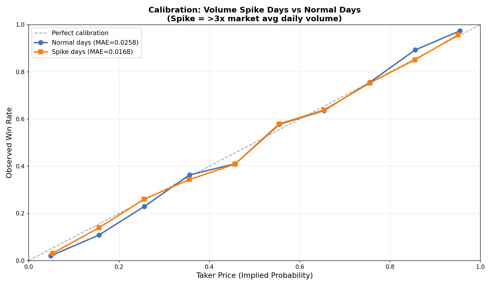

# §6.1: Contrarian Volume Spikes

## Summary

Volume spike days (>3x a market's average daily trade count) exhibit **better calibration** than normal days, with a mean absolute error of 1.68pp vs 2.58pp. This suggests that volume spikes predominantly reflect informed trading rather than uninformed herding -- high-volume days bring prices closer to true probabilities. However, both groups show negative taker excess returns of similar magnitude (-0.88pp spike vs -0.84pp normal), indicating that the improved calibration benefits market makers and limit orders rather than takers.

## Methodology

- **Spike definition:** A market-day is classified as a "spike" if its trade count exceeds 3x that market's historical average daily trade count. Markets must have at least 3 trading days to qualify.
- **Daily volume computation:** For each of the 70,194 qualifying markets, daily trade counts were computed by grouping trades by ticker and calendar date.
- **Calibration:** Trades were bucketed by the taker's price (yes_price for yes-takers, no_price for no-takers) into 10 equal-width bins. Win rate (contract-weighted) was compared against average price in each bin. The taker "wins" when their chosen side matches the market result.
- **Sample sizes:**
  - 612,421 normal market-days containing 22.3M trades (5.4B contracts)
  - 36,476 spike market-days containing 25.9M trades (9.0B contracts)
  - Spike days represent only 5.6% of all market-days but account for 54% of all trades and 63% of all contracts.

## Results

### Calibration: Spike Days vs Normal Days

The calibration curves show that spike-day trades (orange) track the 45-degree perfect-calibration line more closely than normal-day trades (blue). The most significant divergences appear at the tails:

- **Low prices (0-15%):** Normal-day trades undershoot more heavily -- win rates of 2.0% and 10.8% at the 5c and 15c buckets versus 3.1% and 13.9% for spike days. Both groups show longshot bias (prices overstate true probability), but normal days have worse overpricing.
- **High prices (85-95%):** Normal-day trades overshoot dramatically -- a 97.4% win rate at the 95c bucket (1.9pp excess) and 89.3% at the 85c bucket (3.7pp excess). Spike days are tighter: 95.6% at 95c and 85.1% at 85c.
- **Mid-range (35-65%):** Both groups show similar calibration, with spike days being marginally closer to the diagonal. The 45c bucket shows both groups with approximately 41% win rates against ~46% prices (favourite-longshot crossover region).

### Excess Returns

The excess return chart reveals that both spike and normal days exhibit the classic favourite-longshot pattern -- takers overpay for longshots and get bargains on favourites. However, the magnitude differs:

- **Normal days show larger deviations** at the extremes: -4.7pp at the 15c bucket, +3.7pp at the 85c bucket, and +1.9pp at the 95c bucket.
- **Spike days compress these extremes**: -1.6pp at 15c, -0.4pp at 85c, +0.6pp at 95c.
- The 55c bucket is an outlier where spike days show a positive excess return of +2.5pp while normal days show +2.2pp, suggesting both groups benefit from a slight favourite advantage in near-50/50 markets.

### Summary Statistics

| Metric | Spike Days | Normal Days |
|---|---|---|
| Market-days | 36,476 | 612,421 |
| Trades | 25,933,257 | 22,312,648 |
| Contracts | 9.05B | 5.36B |
| MAE (pp) | 1.68 | 2.58 |
| Avg Excess Return | -0.88pp | -0.84pp |
| Avg Taker Price | 48.1c | 45.6c |
| Win Rate (weighted) | 47.2% | 44.8% |

## Key Findings

- **Spike days are better calibrated.** The MAE of 1.68pp on spike days vs 2.58pp on normal days (a 35% reduction) indicates that high-volume episodes bring market prices closer to true probabilities. This is consistent with informed-trading models where volume spikes represent information arrival.
- **The calibration improvement is concentrated at the tails.** The largest differences between spike and normal calibration appear in the extreme price buckets (below 15c and above 85c). On normal days, longshots are substantially overpriced and near-certainties are underpriced; spike-day volume corrects both biases.
- **Taker excess returns are similarly negative for both groups.** Despite better calibration, spike-day takers do not earn better returns (-0.88pp vs -0.84pp). The improved price accuracy appears to be captured by liquidity providers rather than by aggressive takers, suggesting that informed participants on spike days are more likely to be limit-order makers than market-order takers.

## Strategy Implication

The data does **not** support a simple contrarian fade of spike-day volume. Because spike days are better-calibrated, blindly fading the crowd during volume surges would mean trading against more accurately priced markets. Instead, the analysis suggests two potential strategies:

1. **Fade normal-day extremes.** Normal-day longshots (below 15c) are more overpriced and normal-day favourites (above 85c) are more underpriced than on spike days. A contrarian strategy that sells longshots and buys favourites should preferentially execute on low-volume days where miscalibration is larger.
2. **Follow spike-day prices as information signals.** When a volume spike occurs, the resulting prices are more informative. If a spike pushes a market's price significantly, the new price is likely to be more accurate than the pre-spike level, making momentum (not contrarian) the correct posture during spikes.

## Limitations

- **Spike threshold is arbitrary.** The 3x multiplier is a conventional choice; results may differ at 2x or 5x thresholds. The 36,476 spike days represent a reasonable sample but sensitivity analysis across thresholds was not performed.
- **Market heterogeneity.** Some markets are inherently high-volume (e.g., major political events) and some are thin (e.g., niche sports props). The 3x-average definition normalizes per market, but structural differences in market type could confound the spike classification.
- **Taker-side bias.** Calibration is measured from the taker's perspective. If informed participants systematically place limit orders (becoming makers), the taker-side calibration understates the true information content of spike-day activity.
- **No temporal controls.** Spike days may correlate with proximity to market close (when more information is available), which independently improves calibration regardless of volume.
- **Contract weighting.** Results are contract-weighted, meaning large block trades dominate. Unweighted win rates show a qualitatively similar but slightly different pattern, with normal days showing less extreme deviations.
