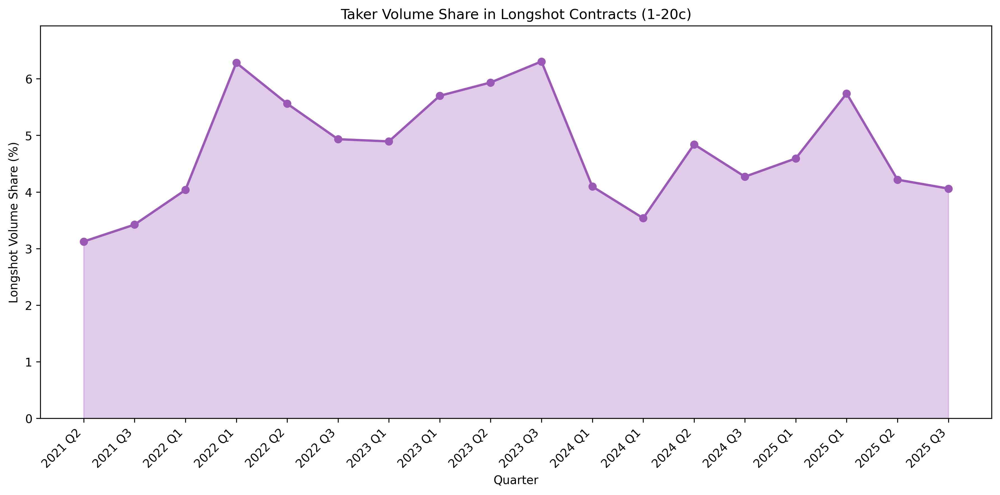

# §6.2: Longshot Volume Share Over Time

## Summary

Longshot contracts (priced 1-20c on the taker side) have consistently commanded between 3% and 6.3% of total taker volume on Kalshi since 2021. The share rose from 3.1% in mid-2021 to a peak of 6.3% in Q4 2023, then retreated to approximately 4.1% by late 2025 as total platform volume exploded 1,500x. The declining longshot share amid massive volume growth suggests that incremental capital entering the platform in 2024-2025 has disproportionately flowed to mid-priced and near-certain contracts, while longshot activity has grown in absolute terms but lost relative share.

## Methodology

- **Longshot definition:** A contract is classified as a longshot if the taker's execution price is between 1c and 20c inclusive. This captures both the 1-10c deep longshot tier and the 11-20c moderate longshot tier. The analysis is measured from the taker's perspective only (the side initiating the trade).
- **Volume metric:** Volume is measured in USD terms, computed as `contracts * taker_price / 100`. This weights each trade by its dollar commitment rather than raw contract count, avoiding distortion from extremely cheap contracts that contribute many contracts but little capital.
- **Time granularity:** Trades are bucketed by calendar quarter using `DATE_TRUNC('quarter', created_time)`.
- **Universe:** All trades on finalized Kalshi markets with a definitive yes/no result. Markets that were cancelled, delisted, or otherwise unresolved are excluded.
- **Sample:** 18 quarters from 2021 Q3 through 2025 Q4, spanning a total of $7.27 billion in taker volume across 4.8 billion contracts and 13.9 million trades.

## Results

### Volume Share Trend

The chart reveals three distinct phases in longshot volume share:

**Phase 1 -- Early Growth (2021 Q3 to 2022 Q2).** Longshot share rose steadily from 3.1% to 6.3% as the platform attracted its first wave of retail speculators. Total quarterly volume was small ($2-10M), and the rising longshot share suggests early adopters were disproportionately drawn to cheap, high-payout contracts. The 6.3% peak in 2022 Q2 coincided with a period of heightened political and macro speculation.

**Phase 2 -- Elevated Plateau (2022 Q3 to 2023 Q4).** Longshot share fluctuated between 4.9% and 6.3%, averaging 5.6% across six quarters. Total quarterly volume grew from $11M to $25M. The share peaked again at 6.3% in 2023 Q4, driven by a surge in the 1-10c bucket (4.31% of total volume, the highest single-quarter reading for deep longshots). This period coincides with the buildup of 2024 election-related markets where speculative positioning on unlikely candidates generated substantial longshot activity.

**Phase 3 -- Dilution (2024 Q1 to 2025 Q4).** Longshot share dropped sharply from 6.3% in 2023 Q4 to 3.5% in 2024 Q2, and has since oscillated in the 4.0-5.7% range. Crucially, this decline occurred despite a massive increase in absolute longshot volume -- from $1.6M in 2023 Q4 to $155M in 2025 Q4, a 97x increase. Total platform volume grew even faster, from $25M to $3.83B (a 153x increase), diluting the longshot share. The 2024 Q4 quarter, dominated by the US presidential election, saw $35M in longshot volume but this represented only 4.3% of the $819M total.

### Key Statistics Table

| Quarter | Longshot Volume (USD) | Total Volume (USD) | Longshot Share (%) | Trades | Contracts |
|---|---|---|---|---|---|
| 2021 Q3 | $65.8K | $2.1M | 3.12 | 10,098 | 988K |
| 2022 Q2 | $629.6K | $10.0M | 6.28 | 50,027 | 7.2M |
| 2023 Q2 | $1.29M | $22.7M | 5.70 | 117,918 | 21.4M |
| 2023 Q4 | $1.59M | $25.2M | 6.31 | 77,741 | 27.9M |
| 2024 Q2 | $1.91M | $53.9M | 3.54 | 87,449 | 26.3M |
| 2024 Q4 | $34.97M | $819.1M | 4.27 | 1,073,827 | 577.5M |
| 2025 Q2 | $47.66M | $830.3M | 5.74 | 1,773,272 | 586.8M |
| 2025 Q4 | $155.33M | $3.83B | 4.06 | 5,851,679 | 1.80B |

The table highlights the dramatic contrast between absolute and relative longshot activity. Longshot dollar volume grew 2,360x from 2021 Q3 to 2025 Q4, while total platform volume grew 1,816x. In absolute terms, longshot trading has never been more active; in relative terms, it has returned to near its 2021 baseline.

### Volume Distribution Shift

The JSON output provides the full 10-bucket volume distribution by quarter. Two structural shifts are notable:

- **The 91-99c bucket has declined from 43-49% to 18% of volume.** In 2021-2023, near-certain contracts (priced 91-99c) consumed 37-49% of all taker volume, reflecting heavy trading in markets approaching resolution. By 2025 Q3-Q4, this bucket dropped to 18%, suggesting that a larger proportion of trading now occurs earlier in market lifetimes when prices are more uncertain.
- **The mid-range (21-70c) has expanded from ~25% to ~44%.** The growth of mid-priced contract volume -- from roughly 25% of total volume in 2021-2023 to 44% in 2025 Q4 -- indicates a shift toward more "contested" markets where outcomes are genuinely uncertain. This is consistent with a more informed, less purely speculative participant base.

## Key Findings

- **Longshot volume share peaked at 6.3% in Q4 2023 and has since declined to ~4.1%, but absolute longshot dollar volume has grown 97x.** The declining share is a composition effect: the platform's growth has been driven by mid-priced and near-certain contracts, not by a retreat from longshots.
- **The 1-10c deep longshot bucket is volatile and event-driven.** It spiked to 4.3% of total volume in 2023 Q4 (election anticipation) but averages only 1.5-2.2% in most quarters. The 11-20c moderate longshot bucket is more stable at 2.0-3.8%, suggesting that deep longshots are speculative event-bets while moderate longshots represent more persistent retail flow.
- **The broader volume distribution has become more balanced over time.** In 2021-2022, the 91-99c bucket alone held 37-43% of volume. By 2025 Q4, no single bucket exceeds 18% and the distribution is substantially flatter. This maturation of the volume profile indicates a more diverse participant base and more competitive pricing across the probability spectrum.

## Strategy Implication

The declining relative share of longshot volume, combined with a flattening volume distribution, suggests that the longshot mispricing documented in §1.1 may face increasing competition over time. As the platform matures and mid-priced contract volume grows, the remaining longshot flow is likely to become more informed, compressing the fade-longshot edge. A calibration exploitation strategy should therefore monitor longshot volume share as a leading indicator: quarters with elevated longshot share (above 5.5%) historically coincide with wider mispricings, making them the preferred windows for aggressive longshot fading. Conversely, periods of low longshot share (below 4%) may indicate a more efficient longshot market and warrant reduced position sizing.

## Limitations

- **The 1-20c longshot threshold is a convention.** Using a 15c cutoff (as in §1.1) would reduce the measured longshot share. The 20c boundary was chosen here for consistency with the analysis module's bucket structure, but the 15-20c range is a grey zone that may include some contracts that are not true longshots.
- **Volume is measured in taker USD, not contract count.** A single 20c longshot trade counts as 20x the volume of a 1c trade. This weights moderate longshots more heavily, potentially masking shifts in very-cheap-contract activity.
- **No adjustment for market composition.** The mix of market types (politics, sports, crypto, weather) has shifted over time. Changes in longshot share may partly reflect changes in which categories dominate the platform rather than changes in participant behaviour within a category.
- **Quarterly granularity smooths event-driven spikes.** Monthly or weekly data would better capture short-lived longshot surges (e.g., around specific elections or surprise events) that are averaged away at the quarterly level.
- **The 2024 Q4 quarter is dominated by the US presidential election.** This single event accounted for a large fraction of the quarter's total volume and its particular price dynamics may not generalise to normal market conditions.
