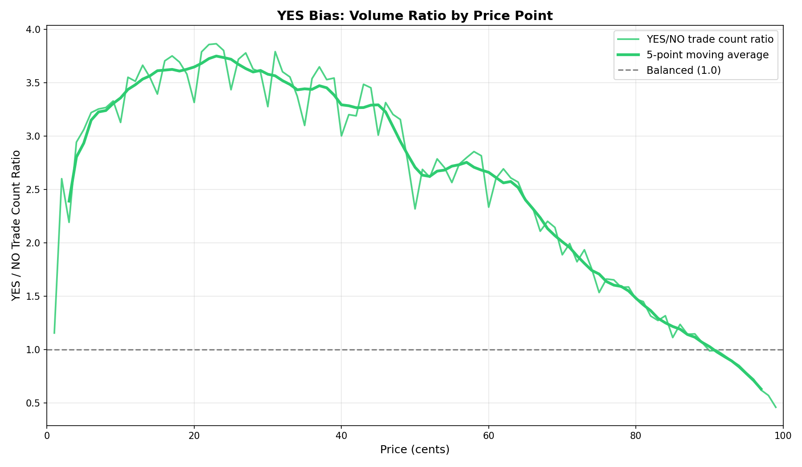
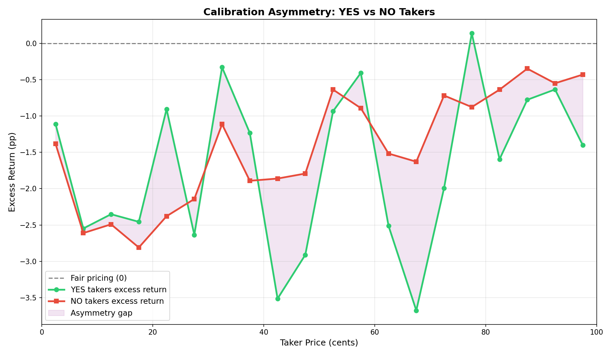
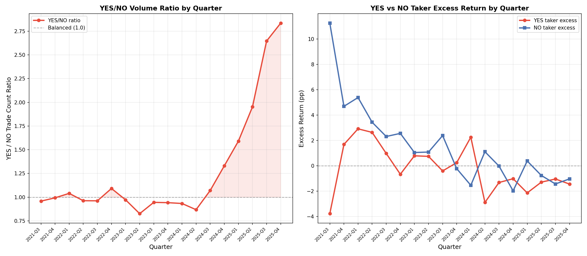

# §6.3: Yes Bias

## Summary

The participation imbalance is still strong, but corrected economics reduce the measured pricing asymmetry.

- YES trades: 46.8M vs NO trades: 21.0M (**2.2298:1**)
- YES excess return (contract-weighted): **-0.9293 pp**
- NO excess return (contract-weighted): **-0.6078 pp**
- YES-NO gap: **-0.3215 pp**

## Methodology

- Universe: finalized Kalshi yes/no markets.
- Volume ratio is computed from trade counts by exact price.
- Excess return uses exact-price expected probability and **contract-weighted** outcomes.
- 5-cent buckets are used for chart smoothing only.

## Volume Imbalance

- Median YES/NO ratio across prices: **2.7627**
- Maximum ratio: **3.865** at 23c
- YES dominance is broad across low/mid prices and only flips at very high prices.

## Cross-Sectional Results

| Price Range | YES Trades | NO Trades | Ratio | YES Excess (pp) | NO Excess (pp) | Gap (pp) |
|---|---:|---:|---:|---:|---:|---:|
| 1-10 | 5,485,648 | 2,239,555 | 2.45 | -1.75 | -1.00 | -0.75 |
| 11-20 | 4,915,662 | 1,378,857 | 3.57 | -2.24 | -2.70 | +0.46 |
| 21-30 | 5,179,933 | 1,414,514 | 3.66 | -0.36 | -1.21 | +0.85 |
| 31-40 | 5,599,783 | 1,622,124 | 3.45 | +0.08 | -2.73 | +2.82 |
| 41-50 | 5,916,765 | 1,931,784 | 3.06 | -4.04 | -4.18 | +0.14 |
| 51-60 | 5,717,695 | 2,130,095 | 2.68 | +1.85 | +1.74 | +0.11 |
| 61-70 | 4,765,803 | 2,032,629 | 2.34 | -2.20 | +0.35 | -2.55 |
| 71-80 | 3,680,127 | 2,182,401 | 1.69 | -0.18 | -0.32 | +0.14 |
| 81-90 | 2,974,699 | 2,493,219 | 1.19 | +0.61 | +0.86 | -0.25 |
| 91-99 | 2,519,554 | 3,543,524 | 0.71 | +0.34 | +0.46 | -0.12 |

## Key Findings

- Behavioral YES preference remains large in flow terms (2.23:1 overall).
- Pricing asymmetry exists but is modest in aggregate after correction (~0.32 pp).
- Both sides have positive and negative sub-ranges; asymmetry is concentrated in specific bands, not uniform across the curve.

## Temporal Note

Temporal YES-bias dynamics (see `figures/6_3_yes_bias_temporal.png`) still show a strong post-2024 rise in YES/NO participation ratios.

## Figures

- 
- 
- 

## Limitations

- Gross of fees and execution costs.
- Trade-count ratio and contract-weighted excess are distinct objects and should not be conflated.
